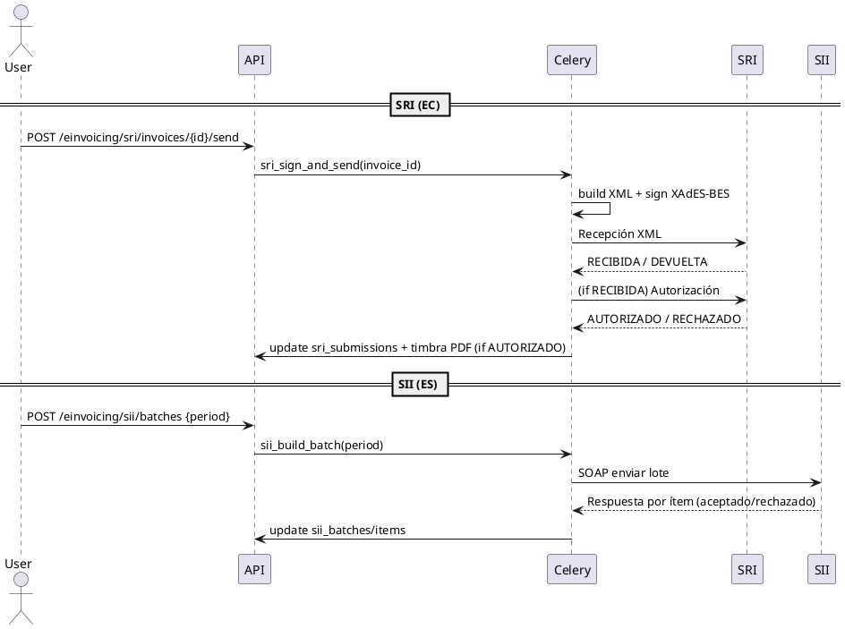

# agents.md — GestiQCloud (v2) End‑to‑End Functional Build Plan

> Plan de construcción **paso a paso** para que un equipo (o un agente de codificación) implemente el ERP SaaS multi‑tenant con todo lo funcional decidido en esta conversación.
>
> **Alcance**: Tenancy UUID + RLS, Gateway, Catálogo/Ventas/Facturas con numeración, Inventario multi‑almacén, POS/Caja, E‑invoicing SII/SRI, Plantillas por vertical (Bazar/Bakery) con overlays, Copiloto (lectura + borradores), Observabilidad, CI/CD, Seguridad, QA & Go‑Live.

---

## Convenciones
- Repo: `gestiqcloud/` (actual).
- Backend: `apps/backend/` (FastAPI + SQLAlchemy). Frontends: `admin` y `tenant` (Vite). Cola: **Celery + Redis**.
- DB: PostgreSQL con **RLS** (tenant_id UUID), extensión `pgcrypto`.
- Dominios: `admin.gestiqcloud.com`, `www.gestiqcloud.com`, `api.gestiqcloud.com` (Worker como gateway).
- Países foco inicial: **España** (ES) y **Ecuador** (EC); preparado para más.
- Vertical piloto: **Bazar** (es‑ES) con templates versionados; **Bakery** disponible.

---

## Milestones (resumen)
- **M0** Infra + dominio API + baseline DB.
- **M1** Tenancy UUID + backfill + RLS + middleware.
- **M2** Catálogo/Ventas + Numeración + PDFs.
- **M3** E‑invoicing (SRI/SII).
- **M4** Plantillas & Overlays (Bazar/Bakery) + `GET /ui-config` + Editor.
- **M5** Observabilidad + CI/CD + Seguridad + Backups.
- **M6** Copiloto (lectura + borradores) **tenant‑first**.
- **M7** Inventario completo + integración Ventas.
- **M8** POS/Caja + conciliación básica.

> Cada milestone tiene un agente responsable y criterios de aceptación.

---

## Agente 0 — Orquestador (Project setup)
**Entradas**: este `agents.md`.

**Tareas**
1. Issues/Milestones: crear tablero con M0–M8 y subtareas de este plan.
2. Ramas: `feat/multitenant-uuid`, `feat/inventory`, `feat/pos`, `feat/einvoicing`.
3. Convención PR: *squash & merge* (`feat(scope): mensaje`).

**Done**: tablero con PR inicial abierto (M0).

---

## M0 — Infra & Baseline — Agente 1
**Objetivo**: dominio API único, baseline de esquema y seeds de plantillas.

**Tareas**
- Worker/Gateway (Cloudflare): allow‑list por host, CORS restrictivo, reescritura cookies (`access=Lax`, `refresh=None`, `Domain=.gestiqcloud.com`), `X-Request-Id`, headers de seguridad.
- Frontends: `.env` → `VITE_API_BASE=https://api.gestiqcloud.com`.
- Baseline DB: generar `ops/migrations/000_init_from_models.sql` con `scripts/py/gen_sql_from_models.py` (Base: `app.db.base.Base`).
- Plantillas: aplicar `ops/migrations/070_templates.sql` + **seeds** `bazar v1` y `bakery v1` (o `scripts/py/import_templates.py`).

**Aceptación**
- `api.gestiqcloud.com` operativo, CORS correcto.
- `template_packages`: `bazar v1` y `bakery v1` presentes.

---

## M1 — Tenancy UUID + RLS — Agente 2
**Objetivo**: aislamiento por tenant (**RLS fuerte**).

**Tareas**
- `001_tenants.sql`: crear `tenants(id uuid, empresa_id int unique, slug, ...)` + backfill desde `core_empresa`.
- `010_add_tenant_uuid_auto.sql`: añadir `tenant_id uuid` en tablas con `empresa_id`, poblar, FK, índices.
- `020_rls_policies_auto.sql`: ENABLE/FORCE RLS + política `USING/WITH CHECK` (con `current_setting('app.tenant_id', true)`).
- Middleware DB: **`SET LOCAL app.tenant_id`** en **la misma Session** de cada request (arregla el anti‑patrón de dos sesiones). Usa `get_db()` con transacción abierta.

**Aceptación**
- Usuarios de otro tenant → 0 filas/403.
- `SELECT current_setting('app.tenant_id', true)` devuelve UUID válido en request.

---

## M2 — Catálogo/Ventas + Numeración + PDFs — Agente 3
**Objetivo**: flujo `pedido → entrega → factura (draft) → post` + PDFs.

**Tareas**
- Productos/Clientes: CRUD + búsquedas; `UNIQUE(tenant_id, sku)`.
- Ventas (app/domain): `confirm_order` (reserva), `deliver_order` (salida), `invoice_from_delivery` (draft), `post_invoice` (numera atómico).
- Series: tablas `doc_series` + función `assign_next_number(tenant,tipo,año,serie)` (lock transaccional).
- PDFs: WeasyPrint (Docker deps), plantillas Jinja, `GET /invoices/{id}/pdf`.

**Aceptación**
- Dos posts concurrentes **no** repiten número.
- PDF descargable con totales correctos.

---

## M3 — Facturación electrónica (SRI/SII) — Agente 4 **(DETALLADO)**
**Objetivo**: Enviar y registrar facturación electrónica para **Ecuador (SRI)** y **España (SII)** con **firmado**, **colas**, **reintentos**, **timbrado de PDF**, **auditoría**, **toggles por tenant** y **mensajería de errores** integrable con el Copiloto.

### Migraciones y modelo de datos
- **`100_einvoicing_queues.sql`** (ya definido):
  - `sri_submissions(id, tenant_id, invoice_id, state, recepcion_status, autorizacion_number, autorizacion_date, payload_xml, ...)`.
  - `sii_batches(id, tenant_id, period, state, last_error, ...)`, `sii_batch_items(id, tenant_id, batch_id, invoice_id, state, error_detail)`.
- **`101_einv_settings.sql`** (añadir):
  - `tenant_einv_settings(tenant_id, country_code, sri_enabled bool, sri_env text, sri_ruc text, sri_estab text, sri_punto_emision text, sri_cert_ref text, sii_enabled bool, sii_nif text, sii_cert_ref text, updated_at)`.
  - **Nota**: *no* guardes certificados en texto plano. Almacena **referencias** (`*_cert_ref`) a un **secret store** (KMS/Secret Manager/Bucket privado) y carga en runtime.
- **`einv_error_catalog`** (opcional): catálogo de códigos → mensajes/acciones (para “Explicar error”).

### Colas y tareas (Celery)
- Colas dedicadas: `sri` y `sii` (workers separados). Reintentos con backoff exponencial, `max_retries` configurable por tenant.
- **Tareas SRI (EC)**:
  1. `sri_sign_and_send(invoice_id)` → construye XML <Factura>, **firma XAdES‑BES** con el .p12 del tenant, envía a **Recepción**.
  2. Si `RECIBIDA`: `sri_poll_autorizacion(submission_id)` → consulta **Autorización**; si `AUTORIZADO`, persiste `autorizacion_number/date` y **timbra el PDF**.
  3. Si `DEVUELTA/RECHAZADA`: actualizar estado y `last_error`; habilitar **reintento** tras corrección.
- **Tareas SII (ES)**:
  1. `sii_build_batch(period)` → agrega facturas **posteadas** (emitidas/recibidas) del período `YYYY-MM`.
  2. `sii_send_batch(batch_id)` → envía **SOAP** (lib oficial o cliente propio); parsea respuesta por ítem; marca `accepted/rejected` a nivel **item**.

### Endpoints API
- **SRI** (`/einvoicing/sri`):
  - `POST /invoices/{id}/send` → enqueue `sri_sign_and_send`.
  - `GET /submissions/{id}` → estado detallado (recepción/autorización, errores).
  - `POST /submissions/{id}/retry` → reintento si `rejected/error`.
  - `GET /invoices/{id}/xml` y `GET /invoices/{id}/pdf` (timbrado si autorizado).
- **SII** (`/einvoicing/sii`):
  - `POST /batches` (body: `period`) → crea y envía batch.
  - `GET /batches/{id}` → estado y detalle de ítems.
  - `POST /batches/{id}/retry` (opcional, sólo ítems fallidos).
- **Soporte** (`/einvoicing/config`):
  - `GET /settings` / `PUT /settings` (por tenant, roles permitidos) para activar **SRI/SII**, `env` y credenciales (referencias a secretos).
  - `POST /explain` (`source: 'SRI'|'SII', code, details`) → devuelve **mensaje y checklist** (usa `einv_error_catalog`).

### Reglas de negocio & validaciones
- **Numeración**: la factura debe estar **posteada** y numerada **antes de enviar** a SRI/SII.
- **Validación previa**: schema local (campos fiscales, totales, tipos de IVA) antes de firmar/enviar.
- **SRI**:
  - Cálculo de **clave de acceso** y estructura de XML según régimen (normal/simplificado) y ambiente (`sri_env = 'test'|'prod'`).
  - Tras **Autorización**: guardar `autorizacion_number/date`, **timbrar PDF** (número y fecha) y bloquear edición de la factura.
- **SII**:
  - Libros **emitidas/recibidas**; soportar **errores parciales**. Reenviar sólo ítems fallidos.
  - Trazabilidad por periodo y **NIF** del emisor.

### Seguridad, auditoría y PII
- Secretos de certificados: sólo **referencias** en BD; carga efímera al firmar.
- Logs sin payloads completos (usar `hash/trace_id`).
- Auditoría: quién envió/reintentó; cambios de settings por tenant.

### Timbrado de PDF (post‑autorización)
- Inyectar en el PDF: número/fecha de **Autorización** (SRI) o **acuse** (SII) si aplica. Regenerar archivo y versionarlo.

### Secuencia (PlantUML)


### Integración con Copiloto
- Botón **“Explicar error”** en UI → `POST /einvoicing/explain` → mensaje en claro + **acciones** (p. ej., “corrige NIF del cliente”, “ajusta tipo de IVA”).
- Acción **“corregir y reintentar”** crea **borrador** corregido; nunca sobrescribe una factura posteada.

### Aceptación (staging)
- **Ecuador**: una factura **AUTORIZADA** (número y fecha en PDF timbrado).
- **España**: un **lote** SII **ACEPTADO** con al menos una factura; ítems rechazados quedan marcados y reintentos funcionan.

---


## M4 — Plantillas & Overlays — Agente 5
**Objetivo**: UI dirigida por plantillas por **tenant**.

**Tareas**
- Esquema: `template_packages`, `tenant_templates`, `template_overlays`, `template_policies` (+ RLS).
- Auto‑asignación al alta de empresa: `tenant_templates(active)` con **última versión** de `template_key`.
- `GET /ui-config`: compone base (package) ⊕ overlays activos.
- **Overlay Editor (Admin)**: añadir/quitar campos extra, ordenar, widgets; validar/activar con límites (15 campos, 8 KB, profundidad 2, tipos permitidos).

**Aceptación**
- Tenants **Bazar** y **Bakery** muestran UI/columnas distintas.
- Overlay activo modifica UI sin cambiar modelo core.

---

## M5 — Observabilidad + CI/CD + Seguridad — Agente 6
**Objetivo**: visibilidad y hardening mínimo.

**Tareas**
- OpenTelemetry: FastAPI/SQLAlchemy/Celery + export OTLP.
- Logs JSON con `X-Request-Id`, `tenant_id`, `user_id`.
- GH Actions: backend (lint/test/build/deploy/migrate), worker (wrangler), frontends (build/deploy).
- Seguridad: HSTS, límites de tamaño, rate‑limit por usuario/tenant, rol DB sin `BYPASSRLS`, backups y prueba de restore.

**Aceptación**
- Dashboards con p50/p95, error rate, colas Celery.
- Deploy a main aplica migraciones sin intervención.

---

## M6 — Copiloto (lectura + borradores, tenant‑first) — Agente 7
**Objetivo**: aumentar velocidad sin riesgo.

**Tareas**
- Servicio AI: `/ai/ask` (Q&A) y `/ai/act` (acciones whitelisted).
- Herramientas backend: `query_readonly`, `create_*_draft`, `explain_tax_response`, `suggest_overlay_fields` (todas con RLS y PII masking).
- UI Tenant: barra de comandos + panel Copiloto + botón “Explicar error” en SRI/SII.
- Feature flags por tenant: `COPILOT_TENANT_ENABLED=true`, acciones permitidas, `COPILOT_LOCALE=es-ES`.
- Catálogo 8–12 consultas: ventas mes, por almacén, top productos, rotación/caducidades, stock bajo, cobros/pagos, margen, pendientes SRI/SII.

**Aceptación**
- Crea borradores válidos (factura/pedido/traspaso), nunca postea.
- Q&A responde tarjetas/atajos correctos.

---

## M7 — Inventario multi‑almacén — Agente 8
**Objetivo**: existencias por almacén, reservas y movimientos atómicos.

**Tareas**
- Migración `080_inventory.sql`: `warehouses`, `stock_items`, `stock_moves` + enums.
- Use cases: `reserve`, `deliver`, `transfer`, `adjust`, `cycle_count`.
- Integración Ventas: `confirm_order` → `reserve`; `deliver_order` → `post out`.
- API `/inventory`: warehouses/stock/moves + acciones.

**Reglas**: toda salida/entrada se **postea** con transacción que actualiza `stock_items` y marca `stock_moves.posted`.

**Aceptación**
- Reserva sube `reserved`; entrega baja `on_hand` y `reserved`; transferencia A→B ok.

---

## M8 — POS/Caja + Conciliación básica — Agente 9
**Objetivo**: venta mostrador y arqueo elemental.

**Tareas**
- Migración `090_pos.sql`: `pos_registers`, `pos_shifts`, `pos_receipts`, `pos_items`, `pos_payments`.
- Use cases: `open_shift`, `add_item/remove_item`, `take_payment`, `post_receipt` (descuenta stock), `close_shift` (arqueo).
- Conciliación básica: link de cobros POS a BankTransaction (si procede) o generar asiento simple.

**Aceptación**
- Tickets/pagos y cierre de caja con descuadre aceptable y stock impactado.

---

## Extras de Plataforma (continuo)
- **Payments AR/AP + conciliación**: matching semiautomático; estados `open/partially/paid`.
- **UoM & Variantes** (retail): conversión unidad y talla/color.
- **Import/Export**: CSV/XLSX (productos/clientes/stock).
- **Notificaciones**: email de facturas, recordatorios de cobro.
- **Webhooks** por tenant y jobs programados.

---

## Checklists clave
- **Functional Rollout Checklist — (no code)**: infraestructura→tenancy→ventas→e‑invoicing→plantillas→copiloto→inventario→POS→go‑live.
- **QA Staging — Tenant Bazar**: disponible como Markdown imprimible, con criterios de PASS/GO y rollback.

---

## Comandos útiles (Makefile sugerido)
```makefile
DB?=$(DATABASE_URL)

migrate:
	psql "$(DB)" -v ON_ERROR_STOP=1 -f ops/migrations/apply.sql

rls:
	DATABASE_URL="$(DB)" python scripts/py/apply_rls.py --schema public --set-default

api:
	uvicorn apps.backend.prod:app --host 0.0.0.0 --port 8000

worker:
	celery -A apps.backend.celery_app worker -Q sri,sii -l info

front-admin front-tenant:
	npm run --prefix apps/$(@:front-%=%) dev
```

---

## Criterios de salida (Go‑Live)
- RLS activo y verificado con tenants cruzados.
- Flujo ventas completo + inventario consistente + numeración atómica.
- E‑invoicing: 1 factura EC `AUTHORIZED`; 1 lote ES `ACCEPTED`.
- Plantillas Bazar/Bakery operativas; overlays dentro de límites.
- Copiloto (tenant piloto) crea borradores útiles y explica errores SRI/SII.
- Observabilidad + CI/CD + backups con restore verificado.

---

## Anexos (archivos ya preparados en el canvas)
- `scripts/py/gen_sql_from_models.py` — genera `000_init_from_models.sql`.
- Pack de migraciones: `001_tenants.sql`, `010_add_tenant_uuid_auto.sql`, `020_rls_policies_auto.sql`.
- `070_templates.sql` + seeds `bazar v1` & `bakery v1` + `scripts/py/import_templates.py`.
- Diseño y endpoints de `GET /ui-config` + **Overlay Editor (React)**.
- Plan de Inventario (`080_inventory.sql`), POS (`090_pos.sql`), E‑invoicing (`100_einvoicing_queues.sql`).
- Checklist QA Bazar (Markdown descargable).

---

## Notas finales
- Mantener `empresa_id` 1–2 releases; luego retirar con migración limpia.
- Cualquier `UNIQUE(code)` global → pasar a `UNIQUE(tenant_id, code)`.
- Índices por expresión en `extra` **sólo** si hay uso frecuente.
- **i18n**: `tenant.locale` (inicial `es-ES`); glosario fiscal por país; formateo por moneda/fecha.

