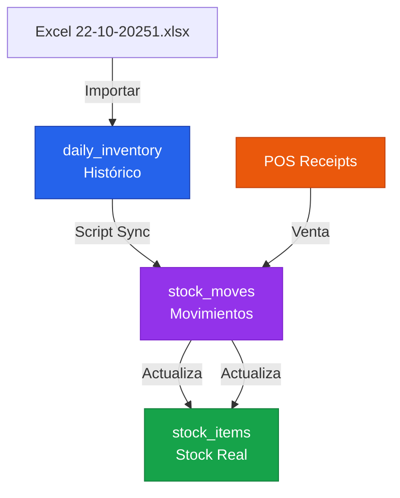

# Arquitectura de Integración de Datos - Evitar Duplicación

## ⚠️ Problema Identificado: Tablas Duplicadas

### Tablas Existentes (Original)
```sql
stock_items        -- Stock actual en tiempo real
stock_moves        -- Movimientos de inventario
pos_receipts       -- Tickets POS
invoices           -- Facturas
```

### Tablas SPEC-1 (Nuevas)
```sql
daily_inventory    -- Inventario diario (para Excel)
sale_header/line   -- Ventas simplificadas
purchase           -- Compras
```

**¿Hay duplicación?** ✅ SÍ - Necesita integración

---

## ✅ Solución: Arquitectura Unificada

### Opción A: SPEC-1 como "Capa de Importación" (RECOMENDADO)

```
Excel 22-10-20251.xlsx
       ↓
daily_inventory (registro histórico)
       ↓
[Proceso de sincronización]
       ↓
stock_items (stock real del ERP)
stock_moves (movimientos reales)
```

**Flujo**:
1. Importas Excel → crea `daily_inventory` (histórico)
2. Script sincroniza → actualiza `stock_items` (real)
3. POS usa `stock_items` (no `daily_inventory`)

---

### Opción B: Usar Solo Tablas Existentes (SIMPLE)

**NO usar SPEC-1**, sino adaptar el importador para:

```
Excel → Productos + stock_moves (kind='opening_balance')
```

**Ventaja**: Sin duplicación  
**Desventaja**: Pierdes trazabilidad del Excel original

---

## 🎯 RECOMENDACIÓN: Opción A con Script de Sync

### 1. Mantener SPEC-1 (Histórico)
`daily_inventory` = **registro del Excel** (no tocar)

### 2. Crear Script de Sincronización
```python
# scripts/sync_daily_to_stock.py

def sync_daily_inventory_to_stock(tenant_id, fecha):
    """
    Sincroniza daily_inventory → stock_items
    
    Para cada producto en daily_inventory(fecha):
    1. Actualizar stock_items.qty = stock_final
    2. Crear stock_move si hubo venta:
       - kind='sale', qty=-venta_unidades
    """
    pass
```

### 3. POS usa Stock Real
```
POS → stock_items (tabla real)
Daily Inventory → histórico Excel
```

---

## 🔧 Implementación Correcta

### Flujo de Datos Unificado



---

## 📋 Tabla de Responsabilidades

| Tabla | Propósito | Actualiza | Lee |
|-------|-----------|-----------|-----|
| **daily_inventory** | Registro histórico Excel | Importador | Reportes históricos |
| **stock_items** | Stock actual real | stock_moves (trigger) | POS, Ventas |
| **stock_moves** | Movimientos (entrada/salida) | POS, Compras, Ajustes | Kardex, Informes |
| **pos_receipts** | Tickets POS | POS | Cierre caja, Reportes |
| **sale_header/line** | Ventas simuladas (solo importador) | Importador Excel | Reportes (opcional) |
| **invoices** | Facturas legales | POS→Factura, Backoffice | Contabilidad, E-factura |
| **purchase** | Compras proveedores | Importador, Form manual | Reportes compras |

---

## 🔄 Script de Sincronización (Crear)

```python
# apps/backend/app/services/sync_inventory.py

from sqlalchemy.orm import Session
from uuid import UUID
from datetime import date
from decimal import Decimal

def sync_daily_to_stock(db: Session, tenant_id: UUID, fecha: date):
    """
    Sincroniza daily_inventory → stock_items + stock_moves
    
    Ejecutar después de importar Excel
    """
    # 1. Obtener daily_inventory del día
    daily_records = db.execute(text("""
        SELECT product_id, stock_final, venta_unidades
        FROM daily_inventory
        WHERE tenant_id = :tenant_id AND fecha = :fecha
    """), {"tenant_id": str(tenant_id), "fecha": fecha}).fetchall()
    
    # 2. Por cada producto
    for record in daily_records:
        product_id = record[0]
        stock_final = record[1]
        venta_unidades = record[2]
        
        # 3. Actualizar stock_items
        db.execute(text("""
            INSERT INTO stock_items (tenant_id, warehouse_id, product_id, qty)
            VALUES (:tenant_id, :warehouse_id, :product_id, :qty)
            ON CONFLICT (tenant_id, warehouse_id, product_id)
            DO UPDATE SET qty = :qty
        """), {
            "tenant_id": str(tenant_id),
            "warehouse_id": 1,  # Almacén principal
            "product_id": product_id,
            "qty": stock_final
        })
        
        # 4. Crear stock_move por venta
        if venta_unidades > 0:
            db.execute(text("""
                INSERT INTO stock_moves (tenant_id, product_id, warehouse_id, qty, kind, ref_type, ref_id)
                VALUES (:tenant_id, :product_id, :warehouse_id, :qty, 'issue', 'daily_inventory', :ref_id)
            """), {
                "tenant_id": str(tenant_id),
                "product_id": product_id,
                "warehouse_id": 1,
                "qty": -venta_unidades,  # Negativo = salida
                "ref_id": str(fecha)
            })
    
    db.commit()
    return len(daily_records)
```

---

## 🚀 Solución Rápida (Ahora Mismo)

### Opción 1: Usar Solo Stock Real (Recomendado Simple)

**NO uses SPEC-1** para operativa diaria. Usa para:
- Importación histórica (una vez)
- Reportes Excel originales
- Auditoría

**Usa para operativa**:
- `stock_items` (stock real)
- `stock_moves` (movimientos)
- `pos_receipts` (tickets POS)

### Opción 2: Sincronizar (Recomendado Completo)

**Después de importar Excel**, ejecutar:
```bash
# Crear endpoint de sync
curl -X POST "http://localhost:8000/api/v1/daily-inventory/sync-to-stock?fecha=2025-10-22" \
  -H "X-Tenant-ID: <UUID>"
```

Esto:
1. Lee `daily_inventory`
2. Actualiza `stock_items` con stock_final
3. Crea `stock_moves` por cada venta

---

## 📊 Integración Correcta

### Para tu caso (Panadería)

```
1. IMPORTAR EXCEL
   22-10-20251.xlsx
   ↓
   daily_inventory (283 registros) ✅

2. SINCRONIZAR (script nuevo - crear)
   daily_inventory
   ↓
   stock_items (283 productos con stock_final)
   stock_moves (283 ventas como 'issue')

3. USAR POS
   POS crea tickets
   ↓
   pos_receipts
   ↓
   stock_moves (kind='sale')
   ↓
   Actualiza stock_items (trigger)
```

---

## ⚡ Acción Inmediata

### Necesitas crear:

**Backend**: Endpoint de sincronización
```python
# apps/backend/app/routers/spec1_daily_inventory.py
# Añadir:

@router.post("/sync-to-stock")
async def sync_to_stock(
    fecha: date = Query(...),
    db: Session = Depends(get_db),
    tenant_id: UUID = Depends(ensure_tenant),
):
    """Sincronizar daily_inventory → stock_items"""
    from app.services.sync_inventory import sync_daily_to_stock
    
    count = sync_daily_to_stock(db, tenant_id, fecha)
    
    return {
        "message": f"Sincronizados {count} productos",
        "fecha": str(fecha)
    }
```

**Servicio**: Script de sincronización (como mostré arriba)

---

## 🎯 ¿Qué Hacer Ahora?

### Para empezar rápido (SIN duplicación):

1. **NO importes a SPEC-1 aún**
2. **Crea productos manualmente** o con importador genérico
3. **Usa POS directamente** (actualiza `stock_items` automático)

### Para usar Excel histórico (CON sincronización):

1. **Importa Excel** → `daily_inventory`
2. **Ejecuta sync** → actualiza `stock_items`
3. **Usa POS** → trabaja sobre `stock_items`

---

**¿Quieres que cree el script de sincronización para unificar todo?**
