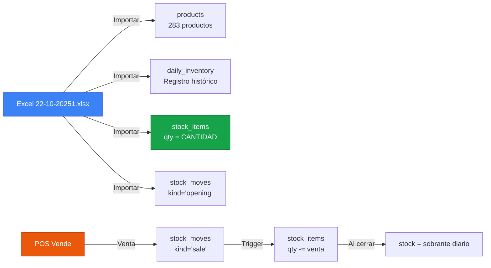

# Integración Excel → ERP (Flujo Correcto)

## 🎯 Concepto Correcto

### El Excel es el STOCK INICIAL del día
- **CANTIDAD** = Stock disponible para vender (inicio del día)
- **VENTA DIARIA** = Lo que se vendió (históricamente)
- **SOBRANTE DIARIO** = Lo que quedó al cierre

### El ERP debe
1. **Importar Excel** → Poblar TODO el sistema
2. **POS vende** → Actualiza stock en tiempo real
3. **Al cerrar día** → Stock actual = Sobrante diario

---

## ✅ Flujo de Integración Completo



---

## 🔧 Modificar el Importador Excel

### Actualmente el importador crea:
```python
# ❌ INCOMPLETO
daily_inventory ✅
sale_header/line ✅ (simuladas)
products ✅
# ❌ FALTA: stock_items, stock_moves inicial
```

### Debe crear:
```python
# ✅ COMPLETO
1. products (si no existen)
2. daily_inventory (registro histórico del Excel)
3. stock_items (qty = CANTIDAD del Excel) ← FALTA
4. stock_moves (kind='opening_balance', qty=CANTIDAD) ← FALTA
5. sale_header/line (opcional - para reportes)
```

---

## 💡 Modificación del Importador

### Archivo a modificar:
`apps/backend/app/services/excel_importer_spec1.py`

### Añadir después de crear `daily_inventory`:

```python
# En el método import_registro_sheet(), después de crear DailyInventory:

# 1. Inicializar stock_items con CANTIDAD (stock inicial)
db.execute(text("""
    INSERT INTO stock_items (tenant_id, warehouse_id, product_id, qty)
    VALUES (:tenant_id, :warehouse_id, :product_id, :qty)
    ON CONFLICT (tenant_id, warehouse_id, product_id)
    DO UPDATE SET qty = :qty
"""), {
    "tenant_id": str(tenant_id),
    "warehouse_id": 1,  # Almacén principal
    "product_id": str(product.id),
    "qty": float(cantidad or 0)  # CANTIDAD del Excel
})

# 2. Crear stock_move de apertura
db.execute(text("""
    INSERT INTO stock_moves (tenant_id, product_id, warehouse_id, qty, kind, ref_type, ref_id, posted_at)
    VALUES (:tenant_id, :product_id, :warehouse_id, :qty, 'opening_balance', 'daily_inventory', :ref_id, NOW())
"""), {
    "tenant_id": str(tenant_id),
    "product_id": product.id,  # Cambia a int si product_id es int
    "warehouse_id": 1,
    "qty": float(cantidad or 0),  # CANTIDAD (positivo)
    "ref_id": str(fecha)
})

# 3. Si hubo venta histórica, crear stock_move de salida
if venta and venta > 0:
    db.execute(text("""
        INSERT INTO stock_moves (tenant_id, product_id, warehouse_id, qty, kind, ref_type, ref_id, posted_at)
        VALUES (:tenant_id, :product_id, :warehouse_id, :qty, 'sale', 'daily_inventory', :ref_id, NOW())
    """), {
        "tenant_id": str(tenant_id),
        "product_id": product.id,
        "warehouse_id": 1,
        "qty": float(-venta),  # NEGATIVO (salida)
        "ref_id": f"HIST_{fecha}_{idx}"
    })
    
    # 4. Actualizar stock_items restando venta histórica
    db.execute(text("""
        UPDATE stock_items
        SET qty = qty - :venta
        WHERE tenant_id = :tenant_id AND product_id = :product_id
    """), {
        "tenant_id": str(tenant_id),
        "product_id": product.id,
        "venta": float(venta)
    })

self.stats["stock_initialized"] += 1
```

---

## 📊 Resultado Después de Importar

### Tablas Pobladas:

#### 1. products (283 registros)
```sql
id, name, sku, price, unit, stock (legacy, no usar)
```

#### 2. daily_inventory (283 registros)
```sql
-- Registro histórico del Excel
fecha: 2025-10-22
stock_inicial: CANTIDAD
venta_unidades: VENTA DIARIA
stock_final: SOBRANTE DIARIO
```

#### 3. stock_items (283 registros)
```sql
-- Stock REAL actual
qty: SOBRANTE DIARIO (después de descontar venta histórica)
-- O si no quieres histórico: qty = CANTIDAD
```

#### 4. stock_moves (566 registros)
```sql
-- 283 movimientos "opening_balance" (+ CANTIDAD)
-- 283 movimientos "sale" (- VENTA DIARIA)
```

---

## 🎯 Operativa Después del Import

### POS Vende un Pan Tapado:
```
1. Usuario crea ticket en POS
   ↓
2. pos_receipts (nuevo ticket)
   ↓
3. stock_moves (kind='sale', qty=-1)
   ↓
4. stock_items.qty -= 1 (trigger o manual)
   ↓
5. Backflush (opcional): consume harina, huevo, etc.
   ↓
6. stock_items MP actualizado
```

**Stock siempre actualizado en tiempo real** ✅

---

## 🔄 Al Final del Día (Cierre)

### Comparación:
```sql
SELECT 
  p.name,
  di.stock_final as esperado,
  si.qty as actual,
  (si.qty - di.stock_final) as diferencia
FROM daily_inventory di
JOIN products p ON p.id = di.product_id
JOIN stock_items si ON si.product_id = di.product_id
WHERE di.fecha = '2025-10-22'
  AND (si.qty - di.stock_final) != 0
```

**Diferencias** = mermas no registradas, robos, etc.

---

## ✅ Modificación Necesaria

### Actualizar `excel_importer_spec1.py`:

Línea ~150, en `import_registro_sheet()`, añadir:

```python
# Después de crear DailyInventory, añadir:

# Inicializar stock real
self._init_stock_items(product.id, cantidad or Decimal("0"))

# Si hubo venta histórica, registrarla
if venta and venta > 0:
    self._create_historical_sale_move(product.id, venta, fecha)
```

Y añadir métodos:

```python
def _init_stock_items(self, product_id, qty):
    """Inicializar stock_items con qty del Excel"""
    self.db.execute(text("""
        INSERT INTO stock_items (tenant_id, warehouse_id, product_id, qty)
        SELECT :tenant_id, id, :product_id, :qty
        FROM warehouses
        WHERE tenant_id = :tenant_id AND is_default = true
        ON CONFLICT (tenant_id, warehouse_id, product_id)
        DO UPDATE SET qty = EXCLUDED.qty
    """), {
        "tenant_id": str(self.tenant_id),
        "product_id": product_id,
        "qty": float(qty)
    })

def _create_historical_sale_move(self, product_id, qty, fecha):
    """Crear movimiento histórico de venta"""
    self.db.execute(text("""
        INSERT INTO stock_moves (tenant_id, product_id, warehouse_id, qty, kind, ref_type, ref_id, posted_at)
        SELECT :tenant_id, :product_id, id, :qty, 'sale', 'historical', :ref_id, NOW()
        FROM warehouses
        WHERE tenant_id = :tenant_id AND is_default = true
    """), {
        "tenant_id": str(self.tenant_id),
        "product_id": product_id,
        "qty": float(-qty),  # Negativo
        "ref_id": f"HIST_{fecha}"
    })
```

---

## 🎯 Resumen: NO hay duplicación

### Arquitectura Correcta:

```
daily_inventory    = Registro del Excel (histórico, auditoría)
stock_items        = Stock REAL actual (lo que tienes AHORA)
stock_moves        = Historial de movimientos (entradas/salidas)
pos_receipts       = Tickets de venta (POS)
invoices           = Facturas legales
```

**Todos complementarios, NO duplicados** ✅

---

**¿Creo la modificación del importador para que funcione correctamente?**
