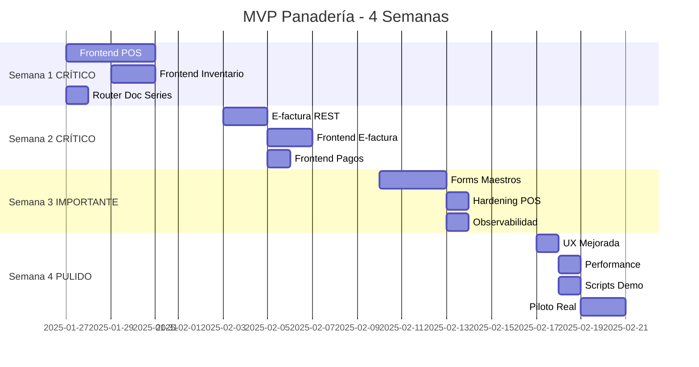

# Plan Estratégico de Desarrollo - GestiQCloud MVP Panadería

**Fecha**: Enero 2025  
**Objetivo**: MVP funcional para panadería en 3-4 semanas  
**Equipo**: 1 dev full-stack

---

## 🎯 Visión del MVP (4 Semanas)

**Panadería profesional** con:
- ✅ Caja/POS operativa (tickets, turnos, impresión)
- ✅ Inventario con stock actualizado
- ✅ Facturación electrónica (ES/EC)
- ✅ Control de compras y producción diaria
- ✅ Backflush automático de materias primas

---

## 🚦 Prioridades (MoSCoW)

### 🔴 MUST HAVE (Crítico - Semanas 1-2)

#### Semana 1: Operativa Diaria (POS + Inventario)
**Entregable**: Caja funcional con impresión y stock actualizado

1. **Frontend POS Completo** (3-4 días) 🔴
   - Dashboard caja con estado de turno
   - ShiftManager (abrir/cerrar)
   - TicketCreator (búsqueda productos, añadir líneas, calcular IVA)
   - PaymentModal (efectivo, tarjeta, vale)
   - InvoiceConverter (ticket→factura con datos cliente)
   - PrintPreview (plantillas 58/80mm ya existen)
   - RefundModal (expandir stub existente)
   
   **Archivos**: 8 componentes React (~1,500 líneas)  
   **Backend**: ✅ Ya existe (900 líneas - pos.py)  
   **Impacto**: Operativa del día a día ✅

2. **Frontend Inventario** (2 días) 🔴
   - StockList (vista actual por producto/almacén)
   - StockMovesList (historial de movimientos)
   - AdjustmentForm (ajustes de inventario)
   - WarehousesList (gestión almacenes)
   
   **Archivos**: 4 componentes (~800 líneas)  
   **Backend**: ✅ Ya existe  
   **Impacto**: Control de stock crítico ✅

3. **Router Doc Series** (0.5 días) 🔴
   - Separar de pos.py a router dedicado
   - CRUD + endpoint reset
   - Integrar en numeración automática
   
   **Archivo**: `routers/doc_series.py` (150 líneas)  
   **Impacto**: Numeración legal obligatoria ✅

**Total Semana 1**: 5.5-6.5 días  
**Resultado**: 🎯 Panadería puede operar en mostrador

---

#### Semana 2: Facturación Electrónica
**Entregable**: E-factura operativa para ES y EC

4. **E-factura Endpoints REST** (1.5 días) 🔴
   - Expandir `routers/einvoicing.py`:
     - POST /send ✅ (stub existe, validar)
     - GET /status/{id} ✅ (stub existe, validar)
     - GET /facturae/{id}/export (nuevo)
     - POST /sri/retry (nuevo)
     - GET /credentials (nuevo)
     - PUT /credentials (nuevo)
   - Gestión de certificados (S3/local cifrado)
   
   **Archivo**: Expandir einvoicing.py (+150 líneas)  
   **Workers**: ✅ Ya existen (700 líneas)  
   **Impacto**: Cumplimiento legal ES/EC ✅

5. **Frontend E-factura** (1.5 días) 🔴
   - EInvoiceStatus (lista estados envío)
   - CredentialsForm (config certificados por país)
   - RetryPanel (reintentar fallidos)
   
   **Archivos**: 3 componentes (~600 líneas)  
   **Impacto**: Gestión e-factura visual ✅

6. **Frontend Pagos Online** (1 día) 🔴
   - PaymentLinkGenerator (generar enlaces)
   - PaymentsList (ver estado pagos)
   - WebhookLogs (opcional, ver eventos)
   
   **Archivos**: 2-3 componentes (~500 líneas)  
   **Backend**: ✅ Ya existe (3 providers)  
   **Impacto**: Cobros a distancia ✅

**Total Semana 2**: 4 días  
**Resultado**: 🎯 Facturación legal operativa

---

### 🟡 SHOULD HAVE (Importante - Semana 3)

#### Semana 3: Maestros y Calidad

7. **Forms Maestros Básicos** (2.5 días) 🟡
   - ClientesForm + Detail (B2B para facturas)
   - ProveedoresForm + Detail (compras MP)
   - ComprasForm (registro manual compras)
   - GastosForm (opcional, si hay tiempo)
   
   **Archivos**: 6-8 componentes (~1,500 líneas)  
   **Impacto**: Gestión de terceros ✅

8. **Hardening POS** (1 día) 🟡
   - Idempotencia client_temp_id en UI
   - Reintentos offline (Workbox)
   - Tests unitarios backend POS
   - Validaciones robustas
   
   **Impacto**: Estabilidad crítica ✅

9. **Observabilidad Básica** (0.5 días) 🟡
   - Request ID en logs
   - Correlación transaccional
   - Métricas básicas (opcional)
   
   **Impacto**: Debugging en producción ✅

**Total Semana 3**: 4 días  
**Resultado**: 🎯 Sistema estable y completo

---

### 🟢 COULD HAVE (Deseable - Semana 4)

#### Semana 4: Pulido y Piloto

10. **UX Mejorada POS** (1 día) 🟢
    - Atajos de teclado
    - Búsqueda rápida productos
    - Lector códigos de barras (getUserMedia)
    
11. **Performance** (0.5 días) 🟢
    - Índices DB faltantes
    - Timeouts workers
    - Retry policies

12. **Scripts Demo** (0.5 días) 🟢
    - Datos de prueba completos
    - Productos panadería (Pan Tapado, etc.)
    - BOM de ejemplo

13. **Piloto Real** (2 días) 🟢
    - Deploy en 1-2 panaderías
    - Recogida feedback
    - Correcciones UX

**Total Semana 4**: 4 días  
**Resultado**: 🎯 Listo para producción

---

## ❌ WON'T HAVE (Post-MVP)

### M2 - Producción Avanzada
- Production Orders completas (PLANIFICADA → EN_PROCESO → FINALIZADA)
- Costeo por lotes real
- Trazabilidad completa de mermas

**Tiempo**: 1-2 semanas  
**Prioridad**: Post-MVP

### M3 - Offline Real
- ElectricSQL integración
- PGlite client
- Reconciliación CRDT

**Tiempo**: 2-3 semanas  
**Prioridad**: Post-MVP

### M4 - Módulos Opcionales
- Contabilidad completa
- RRHH (nóminas, asistencia)
- Finanzas (caja/bancos avanzado)
- Reporting avanzado (dashboards personalizables)

**Tiempo**: 4-6 semanas  
**Prioridad**: Post-MVP

---

## 🎓 Roadmap Visual



---

## ⚠️ Riesgos Identificados & Mitigaciones

### Riesgo 1: Dualidad tenant_id vs empresa_id
**Impacto**: Confusión en queries, posibles fugas de datos

**Mitigación**:
- Mantener mapping en tabla `tenants`
- Helper central para resolver empresa_id → tenant_id
- Validaciones en middleware
- TODO: Migrar todo a UUID post-MVP

**Guardrail**: Tests de RLS para cada tabla

---

### Riesgo 2: Credenciales E-factura
**Impacto**: Seguridad de certificados

**Mitigación**:
- Almacenamiento cifrado (Fernet o similar)
- Rotación y validación al subir
- Sandbox SRI/Facturae antes de producción
- Logs de acceso a certificados

**Guardrail**: Nunca loguear certificados

---

### Riesgo 3: Impresión Térmica
**Impacto**: Inconsistencias por drivers/navegadores

**Mitigación**:
- Plantillas HTML simples ✅ (ya existen)
- Test en impresoras comunes 58/80mm
- Chrome silent printing en kioscos
- Fallback: mostrar HTML para imprimir manual

**Guardrail**: No depender de ESC/POS en MVP

---

### Riesgo 4: Offline-lite Duplicados
**Impacto**: Tickets duplicados si reintenta

**Mitigación**:
- `client_temp_id` en todos los tickets ✅ (ya previsto)
- Backend ignora duplicados por temp_id
- UI muestra "pendiente de envío"
- Reintentos exponenciales (Workbox)

**Guardrail**: Tests de idempotencia

---

### Riesgo 5: Webhooks Pagos
**Impacto**: Pérdida de notificaciones

**Mitigación**:
- Idempotencia por event_id
- Verificación de firmas
- Cola de reintentos (Celery beat opcional)
- Logs de todos los webhooks

**Guardrail**: Monitor de webhooks fallidos

---

## 📊 Métricas de Éxito MVP

### Técnicas
- Disponibilidad POS: > 99%
- Latencia P95 API: < 300ms
- Error rate 5xx: < 0.5%
- Éxito impresión: > 98%
- E-factura aceptadas: > 99%

### Negocio (por tenant piloto)
- Tickets/día: > 50
- Tiempo medio ticket: < 30s
- Conversión ticket→factura: ~10%
- Stock actualizado: tiempo real
- Mermas detectadas: > 0 (backflush)

---

## 🛠️ Entregables por Semana

### Semana 1 ✅
- [ ] 8 componentes POS React
- [ ] 4 componentes Inventario React
- [ ] Router doc_series.py
- [ ] Tests de integración POS
- [ ] Documentación UX POS

### Semana 2 ✅
- [ ] 6 endpoints E-factura REST
- [ ] 3 componentes E-factura React
- [ ] 2 componentes Pagos React
- [ ] Config certificados por país
- [ ] Tests workers E-factura

### Semana 3 ✅
- [ ] 6-8 componentes Forms maestros
- [ ] Idempotencia POS validada
- [ ] 5 tests unitarios críticos
- [ ] Logs con request_id
- [ ] Métricas básicas

### Semana 4 ✅
- [ ] Atajos teclado POS
- [ ] Lector códigos barras
- [ ] Índices DB optimizados
- [ ] Scripts demo panadería
- [ ] Deploy piloto (1-2 tiendas)
- [ ] Documentación usuario

---

## 📚 Archivos por Crear (Estimación)

### Backend (5 archivos - ~1,000 líneas)
```
apps/backend/app/routers/
├── doc_series.py                     # 150 líneas 🔴
├── einvoicing.py (expandir)          # +150 líneas 🔴
└── clientes.py, proveedores.py       # 400 líneas 🟡

apps/backend/app/services/
├── einvoicing_credentials.py         # 100 líneas 🔴
└── payment_link_generator.py         # 100 líneas 🔴

apps/backend/app/tests/
├── test_pos_e2e.py                   # 200 líneas 🟡
└── test_einvoicing.py                # 200 líneas 🟡
```

### Frontend (25+ archivos - ~4,500 líneas)
```
apps/tenant/src/modules/pos/
├── index.tsx                         # 50 líneas 🔴
├── Dashboard.tsx                     # 300 líneas 🔴
├── ShiftManager.tsx                  # 200 líneas 🔴
├── TicketCreator.tsx                 # 400 líneas 🔴
├── PaymentModal.tsx                  # 250 líneas 🔴
├── InvoiceConverter.tsx              # 200 líneas 🔴
├── RefundModal.tsx (expandir)        # 150 líneas 🔴
├── PrintPreview.tsx                  # 150 líneas 🔴
└── services.ts                       # 200 líneas 🔴

apps/tenant/src/modules/inventario/
├── index.tsx                         # 50 líneas 🔴
├── StockList.tsx                     # 300 líneas 🔴
├── StockMovesList.tsx                # 250 líneas 🔴
├── AdjustmentForm.tsx                # 200 líneas 🔴
└── services.ts                       # 150 líneas 🔴

apps/tenant/src/modules/facturacion/
├── EInvoiceStatus.tsx                # 250 líneas 🔴
├── CredentialsForm.tsx               # 200 líneas 🔴
└── RetryPanel.tsx                    # 150 líneas 🔴

apps/tenant/src/modules/pagos/
├── index.tsx                         # 50 líneas 🔴
├── PaymentLinkGenerator.tsx          # 250 líneas 🔴
└── PaymentsList.tsx                  # 200 líneas 🔴

apps/tenant/src/modules/{clientes,proveedores,compras}/
├── Form.tsx (×3)                     # 900 líneas 🟡
└── Detail.tsx (×3)                   # 600 líneas 🟡
```

**Total**: ~4,500 líneas código + ~500 líneas tests

---

## 🏗️ Arquitectura - Gaps Identificados

### 1. Doc Series Acoplado ⚠️
**Problema**: Lógica de series mezclada en pos.py  
**Solución**: Router dedicado `doc_series.py`  
**Beneficio**: Reutilizable por facturación/ventas

### 2. Tenancy Mixto ⚠️
**Problema**: empresa_id (int) vs tenant_id (UUID)  
**Solución Temporal**: Helper central resolver_tenant()  
**Solución Definitiva**: Migrar todo a UUID (M3)  
**Guardrail**: Tests RLS exhaustivos

### 3. E-factura Credenciales ⚠️
**Problema**: No hay CRUD de certificados  
**Solución**: Endpoints GET/PUT + cifrado Fernet  
**Guardrail**: Secrets manager, rotación

### 4. Idempotencia Offline ⚠️
**Problema**: Duplicados en reintentos  
**Solución**: client_temp_id en UI + constraint DB  
**Guardrail**: Tests de duplicación

### 5. Observabilidad ⚠️
**Problema**: Logs dispersos, sin correlación  
**Solución**: request_id + tenant_id en contexto  
**Guardrail**: Structured logging JSON

---

## ✅ Feature Flags Recomendados

```bash
# .env
BACKFLUSH_ENABLED=0           # 0=off, 1=on (activar con BOM listos)
EINVOICING_SANDBOX=1          # 1=sandbox SRI/Facturae, 0=producción
PAYMENT_PROVIDER_ES=stripe    # stripe (España)
PAYMENT_PROVIDER_EC=kushki    # kushki o payphone (Ecuador)
ELECTRIC_SYNC_ENABLED=0       # M3 offline real
IMPORTS_ENABLED=1             # ✅ Ya existe
RATE_LIMIT_ENABLED=1          # ✅ Ya existe
```

---

## 🧪 Testing Strategy

### Tests Críticos (Semana 3)
```python
# Backend
tests/test_pos_e2e.py              # Flujo completo: turno → ticket → cobro → cierre
tests/test_einvoicing.py           # SRI + Facturae workers
tests/test_doc_series.py           # Numeración secuencial
tests/test_backflush.py            # Consumo MP
tests/test_idempotency.py          # Duplicados POS

# Frontend (Vitest)
modules/pos/TicketCreator.test.tsx  # Lógica de cálculo
modules/pos/PaymentModal.test.tsx   # Validaciones de cobro
```

### Tests Manuales (Semana 4)
- Flujo E2E: abrir turno → vender → facturar → e-factura → cerrar
- Offline: desconectar red → venta → reconectar → sync
- Impresión: probar en impresoras reales 58/80mm
- Multi-tenant: verificar aislamiento datos

---

## 📈 KPIs de Progreso

### Semana 1 (Finalizada)
- [x] SPEC-1 Backend 100%
- [x] SPEC-1 Frontend 100% (panadería)
- [x] Rutas API corregidas
- [x] Documentación completa

### Semana 2 (En curso)
- [ ] POS Frontend 0% → 100%
- [ ] Inventario Frontend 0% → 100%
- [ ] Doc Series Router 100%

### Semana 3
- [ ] E-factura REST 95% → 100%
- [ ] E-factura Frontend 0% → 100%
- [ ] Pagos Frontend 0% → 100%
- [ ] Forms maestros 20% → 80%

### Semana 4
- [ ] Tests coverage 0% → 40%
- [ ] Piloto en producción
- [ ] Feedback recopilado

---

## 🚀 Deployment Incremental

### Week 1: Staging
```bash
# Deploy a entorno staging
git push staging week-1-pos-inventory
# Pruebas internas
```

### Week 2: Staging
```bash
git push staging week-2-einvoicing
# Pruebas con certificados sandbox
```

### Week 3: Pre-Production
```bash
git push preprod week-3-forms
# UAT con usuarios internos
```

### Week 4: Production Piloto
```bash
git push production mvp-v1.0
# Desplegar en 1-2 panaderías reales
```

---

## 🎯 Señales de Éxito MVP

### Técnicas
✅ Todos los tests pasan  
✅ Sin errores críticos en logs  
✅ Latencia < 300ms  
✅ Disponibilidad > 99%  

### Negocio
✅ Cajero puede hacer venta completa en < 30s  
✅ Impresión funciona en hardware real  
✅ E-factura se envía y acepta  
✅ Stock actualiza automáticamente  
✅ Usuario final satisfecho (NPS > 8)

---

## 📞 Hitos de Revisión

### Día 5 (Fin Semana 1)
**Demo**: Venta completa con impresión  
**Decisión**: ¿Continuar o ajustar?

### Día 10 (Fin Semana 2)
**Demo**: Factura electrónica enviada  
**Decisión**: ¿Sandbox OK para producción?

### Día 15 (Fin Semana 3)
**Demo**: Sistema completo interno  
**Decisión**: ¿Listo para piloto?

### Día 20 (Fin Semana 4)
**Demo**: Piloto funcionando  
**Decisión**: Go/No-Go producción general

---

## 🎓 Recursos y Documentación

### Implementados ✅
- AGENTS.md - Arquitectura completa
- SPEC1_IMPLEMENTATION_SUMMARY.md - SPEC-1 técnico
- SPEC1_QUICKSTART.md - Guía 5 minutos
- FRONTEND_PANADERIA_COMPLETE.md - Frontend panadería
- DEPLOYMENT_CHECKLIST.md - Deployment
- IMPLEMENTATION_COMPLETE_FINAL.md - Resumen ejecutivo
- PENDIENTES_DESARROLLO.md - Análisis pendientes

### Por Crear 📝
- POS_FRONTEND_GUIDE.md - Guía implementación POS UI
- EINVOICING_SETUP.md - Configuración e-factura
- TESTING_STRATEGY.md - Plan de testing
- USER_MANUAL.md - Manual de usuario

---

## 🎯 Next Steps Inmediatos

### Ahora Mismo
1. Revisar este plan con stakeholders
2. Confirmar prioridades
3. Asignar recursos

### Mañana (Día 1)
1. Crear rama `feature/pos-frontend`
2. Setup estructura `modules/pos/`
3. Implementar Dashboard.tsx (primer componente)

### Esta Semana
1. Completar POS Frontend (8 componentes)
2. Completar Inventario Frontend (4 componentes)
3. Router Doc Series

---

**Estado General**:
- Backend: 90% ✅ Production-Ready
- Frontend: 45% ⚠️ Needs Work
- Documentación: 95% ✅ Excelente

**Próximo hito**: Frontend POS (Semana 1) 🎯

---

**Aprobado por**: _______________________  
**Fecha inicio**: _______________________  
**Fecha objetivo MVP**: 4 semanas desde inicio
