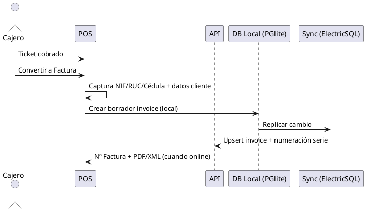
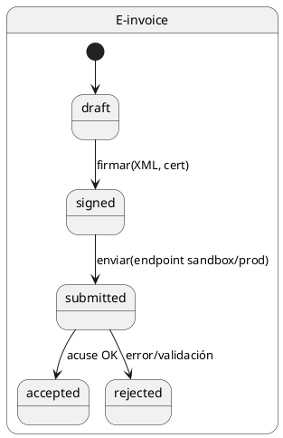
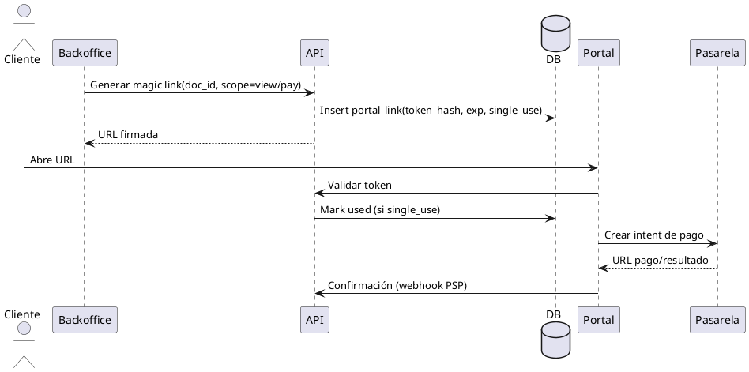
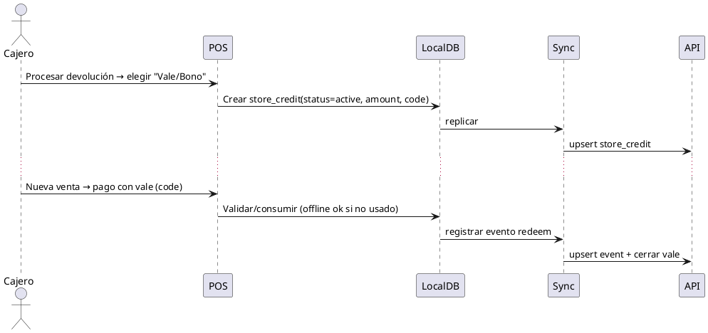

# SPEC-1—SaaS ERP/CRM PyME ES+EC

## Background

SaaS ERP/CRM multi‑tenant dirigido a **autónomos y pymes (1–10 empleados)** de España y Ecuador, con escalabilidad a más usuarios por tenant. Sectores iniciales: **Retail/Bazar**, **Taller Mecánico** y **Panadería**. Necesidades clave: **TPV** con ventas por unidad y peso, **e‑factura** desde el MVP (ES: Facturae; EC: SRI), gestión de inventario con **caducidad simple** y **mermas**, CRM básico y contabilidad simplificada. Prioridades de cumplimiento: **RGPD/LOPDGDD (ES)** y normativa de protección de datos en **Ecuador**, soporte multi‑moneda **EUR/USD**, plantillas de documentos y fiscalidad por país.

## Requirements (MoSCoW)

### Must Have (MVP)
- **TPV offline‑first**: PWA instalable, Service Worker (caché y cola), base de datos local **PGlite (Postgres WASM)** con sincronización **ElectricSQL**, reconciliación y resolución de conflictos.
- **SaaS/Multi‑tenant**: tenants por empresa, alta/baja de organizaciones, planes de suscripción, límites de uso, RBAC por rol/perfil, auditoría y trazabilidad.
- **Localización ES/EC**: impuestos locales (IVA, retenciones, series de documentos), multi‑moneda (EUR/USD), numeraciones y series por establecimiento, plantillas de documentos por país.
- **CRM básico**: cuentas/empresas, contactos, actividades/tareas, pipeline de oportunidades (Kanban), notas y archivos.
- **Ventas**: presupuestos, pedidos, albaranes/entregas, facturas y abonos, e‑factura (ES: Facturae; EC: SRI) **desde MVP**.
- **Compras**: solicitudes/RFQ, pedidos a proveedor, recepción/entradas, facturas proveedor, devoluciones.
- **Catálogo de Productos/Servicios**: SKUs, variantes (talla/color), códigos de barra/QR, **productos de peso variable (PLU)**, impuestos y unidades de medida.
- **Inventario simple**: existencias por almacén, movimientos/ajustes, transferencias internas, mermas, **caducidad/vida útil simple** (panadería), **unidades de medida y conversión básica** (kg ↔ unidad).
- **TPV (POS) ligero**: ventas mostrador con **cámara como lector de códigos** (QR/EAN‑13) en MVP, **ventas por unidad y por peso (entrada manual de peso en MVP)**, caja/arqueos (cajón **manual**), **ticket simplificado** y **conversión a factura** desde el POS (captura rápida de **NIF/RUC/Cédula**), soporte de impresoras comunes.
- **Servicio / Órdenes de Trabajo** (talleres): OT con repuestos y mano de obra, checklist, fotos, citas/agenda.
- **Proyectos + Partes de Hora** (servicios profesionales): tareas, imputación de horas y materiales, facturación por hitos/tiempo.
- **Cobros/Pagos (online)**: **ES: Redsys + Stripe**, **EC: Kushki + PayPhone (enlace/QR)**. Cash siempre soportado. **Tarjeta requiere conexión** (sin modo offline de autorización); **enlace de pago** puede generarse offline y enviarse al reconectar.
- **Gastos y Contabilidad Simplificada**: plan de cuentas básico, asientos automáticos de ventas/compras/cobros/pagos, balances esenciales (diario, mayor, P&L, balance).
- **Informes esenciales**: ventas por período/cliente/producto, márgenes, IVA, cartera de cobros/pagos, rotación de inventario, actividad comercial.
- **Portal del Cliente**: acceso a presupuestos/pedidos/facturas, pagos online básicos, incidencias.
- **Seguridad & Cumplimiento**: RGPD/LOPDGDD (ES) y protección de datos (EC), control de acceso, cifrado en reposo y tránsito, backups y restauración.
- **API pública**: REST + webhooks para integraciones, claves por tenant.

### Should Have (próximas iteraciones)
- **Multi‑tienda**: múltiples tiendas por empresa con cajas/stock/series independientes y transferencias entre tiendas.
- **Producción panadería ligera**: recetas, hojas de horneado, consumo de insumos y mermas automáticas.
- **Integración con balanzas** (lectura de peso por puerto/driver o API del fabricante).
- **Contabilidad completa** (doble partida), conciliación bancaria automática (formatos bancarios locales), asientos predefinidos por país.
- **Integraciones e‑commerce**: conectores Shopify/WooCommerce (pedidos, clientes, catálogo, stock).
- **Pasarelas de pago locales**: ES (Redsys, Stripe, etc.), EC (proveedores locales y/o Stripe donde aplique).
- **E‑factura avanzada**: firma/certificados, numeración y contingencia offline para TPV.
- **Devoluciones/RMA y garantías**.
- **Lotes/Series y Caducidades** (trazabilidad ligera).
- **Multi‑almacén con ubicaciones**.
- **Automatizaciones CRM**: reglas/etiquetas, campañas básicas por email/SMS/WhatsApp Business API.
- **App móvil (field service)**: OT offline, checklists, firma del cliente.
- **Gestor Documental (DMS)** con OCR para facturas y tickets.
- **Cuadros de mando/KPIs configurables**.
- **Plantillas por sector** (retail/bazar, taller mecánico, panadería, textil) con flujos preconfigurados.
- **Reporting fiscal regional**: SII/TicketBAI (según obligación), ATS/retenciones (EC).

### Could Have (a futuro)
- **Fabricación/MRP ligero**: BOM, órdenes de fabricación, centros de trabajo.
- **Programas de fidelización**: puntos, cupones, monedero.
- **Suscripciones/recurrencia** (mantenimientos, servicios).
- **Forecasting/IA**: demanda, reaprovisionamiento, propensión a compra.
- **Comunicaciones**: centralita/VoIP integrada, chat web.
- **E‑commerce nativo** (tienda online propia) y marketplace connectors.
- **Integración logística**: transportistas (ES: Correos/MRW/Seur; EC: Servientrega/Tramaco, etc.).
- **TPV offline‑first** con sincronización diferida.

### Won’t Have (por ahora)
- Nómina/Payroll nativa (se hará vía **integraciones**).
- WMS/Logística avanzada (radiofrecuencia, slotting, cross‑docking).
- SII/TicketBAI **obligatorios en MVP** (solo si un cliente objetivo lo exige desde el inicio).
- BI corporativo a gran escala (se cubrirá con integraciones a Lakehouse/BI externo).
- RR. HH. completo (evaluaciones, reclutamiento, etc.).

### Notas rápidas por sector (cómo se cubren con módulos)
- **Retail/Bazar**: TPV, inventario con variantes/códigos de barras, promociones, devoluciones; e‑factura y libros IVA.
- **Panadería**: TPV con **peso variable/PLU**, caducidades cortas, mermas; listas de producción/horneadas (iteración siguiente), etiquetas con alérgenos (iteración siguiente), e‑factura.
- **Taller Mecánico**: OT, repuestos, tiempos, presupuestos/aprobaciones, facturación por OT, historial por vehículo/cliente.


## Method

### Arquitectura base (borrador)

```plantuml
@startuml
skinparam componentStyle rectangle

package "Frontends" {
  [POS PWA Offline] as POS
  [Backoffice Web] as BACK
}

component "Service Worker
(Workbox)" as SW
component "DB local
(PGlite WASM Postgres)" as LocalDB
component "Sync Client" as SyncClient

node "AWS (Primario EU - eu-south-2)" {
  [API BFF / Gateway
NestJS 11] as API
  [Servicio de Sync
(ElectricSQL)] as SyncSrv
  [Aurora PostgreSQL 16
(Writer + Replicas)] as PG
  [Cola de Mensajes
(SQS/SNS)] as MQ
  [Workers e-Factura
(ES Facturae, EC SRI)] as EFACT
  [Almacenamiento
S3 + CloudFront] as S3
  [Autenticación
Cognito] as COG
  [Pagos ES: Redsys/Stripe] as PAYES
  [Pagos EC: Kushki/PayPhone] as PAYEC
  [Impresión 58/80mm
(HTML→PDF/ESC-POS)] as PRINT
}

node "AWS (Secundario SA - sa-east-1)" {
  [Aurora Global DB
(Read-Replica, solo tablas no-PII)] as PGSA
}

cloud "(Futuro) AWS European Sovereign Cloud" as AWSESC

POS -down-> SW
SW -down-> LocalDB
POS -right-> SyncClient
SyncClient -down-> API : REST/WebSocket
SyncClient -down-> SyncSrv : Sync Protocol
API -down-> PG
SyncSrv -down-> PG
PG -right-> PGSA : Global Replication (tabla-level policies)
API -right-> AWSESC : EU-only tenants (futuro)
API -down-> MQ
MQ -down-> EFACT
API -down-> PAYES
API -down-> PAYEC
API -down-> PRINT
BACK -down-> API
POS -down-> API : Login via Cognito
API -down-> S3
@enduml
```

### Impresión térmica (MVP)
- **Formato**: soportar 58 mm (ancho útil 48 mm) y 80 mm.
- **Plantillas**: recibo HTML/CSS con `@page { width: 58mm; margin: 0 }` y contenedor `width: 48mm`.
- **Resolución de referencia**: 200–203 dpi → **48 mm ≈ 378–384 px**; tipografía monoespaciada opcional.
- **Métodos**:
  1) **Impresión del sistema** (HTML→PDF) desde la PWA (universal, ideal para pruebas).
  2) **ESC/POS por red** (si impresora expone TCP/9100).
  3) **Bluetooth** (si el navegador/OS lo permite) con adaptador nativo en iteraciones futuras.
- **Cola offline**: si no hay red, el ticket se marca **pendiente de impresión** y se reintenta al reconectar.

### Esquema de datos mínimo para TPV (MVP)

```plantuml
@startuml
entity tenants { id uuid PK; name; country; plan }
entity users { id uuid PK; tenant_id FK; email; role; pii_level int default 1 }
entity stores { id uuid PK; tenant_id FK; name; country; currency }
entity products { id uuid PK; tenant_id FK; sku; name; type; uom; tax_code; price }
entity product_variants { id uuid PK; product_id FK; attr_json }
entity stocks { id uuid PK; store_id FK; product_id FK; qty_on_hand; lot nullable; expires_at nullable }
entity customers { id uuid PK; tenant_id FK; name; tax_id; country; address nullable }
entity cash_sessions { id uuid PK; store_id FK; opened_by FK users; opened_at; closed_at nullable; opening_float; closing_total nullable }
entity tickets { id uuid PK; store_id FK; session_id FK; number; status; customer_id nullable; gross_total; tax_total; currency; created_at }
entity ticket_lines { id uuid PK; ticket_id FK; product_id FK; qty; uom; unit_price; tax_rate; discount_pct; line_total }
entity ticket_payments { id uuid PK; ticket_id FK; method; amount; ref nullable }
entity invoices { id uuid PK; tenant_id FK; store_id FK; number; series; customer_id FK; ticket_id nullable; status; subtotal; tax_total; total; currency; created_at }
entity invoice_lines { id uuid PK; invoice_id FK; product_id FK; qty; uom; unit_price; tax_rate; discount_pct; line_total }

products ||--o{ product_variants
stores ||--o{ stocks
stores ||--o{ cash_sessions
cash_sessions ||--o{ tickets
products ||--o{ ticket_lines
customers ||--o{ tickets
 tickets ||--o{ ticket_lines
 tickets ||--o{ ticket_payments
customers ||--o{ invoices
invoices ||--o{ invoice_lines
 tickets ||--o{ invoices : optional link
@enduml
```plantuml
@startuml
entity tenants { id uuid PK; name; country; plan }
entity users { id uuid PK; tenant_id FK; email; role; pii_level int default 1 }
entity stores { id uuid PK; tenant_id FK; name; country; currency }
entity products { id uuid PK; tenant_id FK; sku; name; type; uom; tax_code; price }
entity product_variants { id uuid PK; product_id FK; attr_json }
entity stocks { id uuid PK; store_id FK; product_id FK; qty_on_hand; lot nullable; expires_at nullable }
entity cash_sessions { id uuid PK; store_id FK; opened_by FK users; opened_at; closed_at nullable; opening_float; closing_total nullable }
entity tickets { id uuid PK; store_id FK; session_id FK; number; status; customer_id nullable; gross_total; tax_total; currency; created_at }
entity ticket_lines { id uuid PK; ticket_id FK; product_id FK; qty; uom; unit_price; tax_rate; discount_pct; line_total }
entity ticket_payments { id uuid PK; ticket_id FK; method; amount; ref nullable }
entity sync_ops { id uuid PK; client_id; entity; op; payload_json; version; status }

products ||--o{ product_variants
stores ||--o{ stocks
stores ||--o{ cash_sessions
cash_sessions ||--o{ tickets
products ||--o{ ticket_lines
 tickets ||--o{ ticket_lines
 tickets ||--o{ ticket_payments
@enduml
```

### Documento: Ticket → Factura (MVP)

#### Flujo


#### Reglas
- Numeración **serie + número** por `tenant_id` + `store_id` (aunque MVP tenga una tienda, dejamos clave compuesta para futuro).
- Conversión **no modifica** el ticket original; la factura referencia `ticket_id`.
- Si offline, la factura queda **en borrador** con **número provisional**; al sincronizar, el servidor **asigna número final** (idempotencia por `client_temp_id`).

### Reglas de conflicto (resumen)
- **Tickets**: idempotencia por `number` + `store_id` + `session_id`. Si colisión, se crea **nota de ajuste**.
- **Stock**: política **"reservar y reconciliar"**: venta offline descuenta de `qty_on_hand` local; al sincronizar, se aplica como **movimiento** y si hay negativo, se genera **ajuste** y alerta.
- **Caja**: solo permite **una sesión abierta por TPV**. Merge por timestamp con validación de totales; divergencias ⇒ incidente para revisión.

### Política de residencia de datos (MVP)
- **Modo EU‑Only** (por defecto): **sin replicación** de tablas con PII fuera de EU. Tablas marcadas con `pii_level > 0` **no** se añaden a Aurora Global DB.
- **Modo Global‑Read** (opt‑in por tenant): replicación a **sa‑east‑1** solo de **tablas no‑PII** (ventas agregadas, catálogo, precios, stock). Datos personales se **pseudonimizan** o se sirven vía API EU con caché.
- **Soberanía estricta (futuro)**: opción de despliegue en **AWS European Sovereign Cloud** cuando esté disponible para clientes que lo requieran.

### Decisiones fijadas
- **Motor de sincronización**: **ElectricSQL** con **PGlite** en cliente.
- **Residencia**: Primario **EU (Madrid)**, lectura global limitada a **no‑PII**; explorar **AWS European Sovereign Cloud** (2025) para clientes con soberanía.


### Modelo fiscal (MVP)

- Configurable por **tablas en BBDD** por **país**, **categoría de producto** y **producto**.
- Soporta **IVA** (ES/EC), **ICE** (EC), **exento**, y **retenciones** (IVA/IRPF en ES; IVA/IR en EC) a nivel de documento.
- Política de redondeo (MVP): **por línea** a 2 decimales; totales por suma de líneas.
- **POS**: precios **con impuestos incluidos** por defecto; Backoffice permite listas sin impuestos para B2B.

```plantuml
@startuml
entity tax_schemes { id uuid PK; country char(2); code; name }
entity tax_categories { id uuid PK; scheme_id FK; code; name; kind enum('VAT','ICE','EXEMPT') }
entity tax_rates { id uuid PK; category_id FK; rate numeric(6,4); price_includes_tax bool; valid_from date; valid_to date nullable }
entity product_tax_map { product_id FK; category_id FK; PRIMARY KEY(product_id) }
entity retention_rules { id uuid PK; country char(2); scope enum('sales','purchases'); tax enum('VAT','INCOME'); percent numeric(6,4); conditions jsonb }
entity invoice_tax_lines { id uuid PK; invoice_id FK; tax_category_id FK; base numeric(12,2); rate numeric(6,4); amount numeric(12,2) }
entity invoice_withholding_lines { id uuid PK; invoice_id FK; type enum('VAT','INCOME'); base numeric(12,2); rate numeric(6,4); amount numeric(12,2) }

products ||--o{ product_tax_map
invoices ||--o{ invoice_tax_lines
invoices ||--o{ invoice_withholding_lines
@enduml
```

**Cálculo (MVP, pseudocódigo)**
```text
for each line in invoice.lines:
  rate = get_active_rate(product_tax_map[line.product_id], invoice.date)
  if rate.price_includes_tax:
    base = round(line.total / (1 + rate.rate), 2)
    tax  = round(line.total - base, 2)
  else:
    base = line.total
    tax  = round(base * rate.rate, 2)
  add invoice_tax_lines(base, rate, tax)

# Retenciones a nivel documento (si reglas aplican por país y tipo de cliente)
for each rule in retention_rules.match(invoice):
  base = select_base(rule, invoice)
  amount = round(base * rule.percent, 2)
  add invoice_withholding_lines(rule.type, base, rule.percent, amount)
```

### Certificados de e‑factura (MVP)

- **Aporte del cliente**: sube su certificado (**.p12/.pfx** o **.pem + key**) por tenant.
- **Custodia cifrada**: almacenado en **S3** con **cifrado por objeto** y **Envelope Encryption (AWS KMS)**; metadatos en BBDD.
- **Acceso controlado**: solo **worker de firma** puede desencriptar; clave en memoria **ephemeral** durante la firma.
- **Rotación**: recordatorios N‑días antes de `not_after`; soporte de múltiples certificados por tenant (rollover).
- **Auditoría**: logs de acceso/uso y resultado de firmas.

### E‑factura: entornos por tenant (sandbox obligatorio)
- A nivel de **tenant**, banderas:
  - `es_einvoice_env` ∈ {`sandbox`,`prod`}
  - `ec_einvoice_env` ∈ {`sandbox`,`prod`}
- **Estados del documento electrónico**: `draft → signed → submitted → accepted/rejected`.
- **Rutas**: cuando `sandbox`, los workers apuntan a endpoints de prueba (Facturae/SRI) y los documentos llevan marca **NO FISCAL** en el PDF.



### Seguridad y RBAC (MVP)

**Roles**: **Owner**, **Manager**, **Cajero/Operario**, **Contable**.

**Matriz de permisos (resumen MVP)**

| Funcionalidad | Owner | Manager | Cajero/Operario | Contable |
|---|:--:|:--:|:--:|:--:|
| Alta/Baja de empresa, planes, dominios | ✔︎ | ✖︎ | ✖︎ | ✖︎ |
| Gestión de usuarios/roles | ✔︎ | ✔︎ | ✖︎ | ✖︎ |
| Configurar impuestos/series/plantillas | ✔︎ | ✔︎ | ✖︎ | ✔︎ (ver) |
| Catálogo (productos, precios, impuestos por producto) | ✔︎ | ✔︎ | ✖︎ | ✖︎ |
| POS: vender/cobrar | ✔︎ | ✔︎ | ✔︎ | ✖︎ |
| POS: devoluciones/abonos | ✔︎ | ✔︎ | (opcional por permiso) | ✖︎ |
| Caja: abrir/cerrar, arqueos | ✔︎ | ✔︎ | ✔︎ | ✖︎ |
| Inventario: ver | ✔︎ | ✔︎ | ✔︎ (stock/reserva) | ✔︎ |
| Inventario: ajustes/movimientos | ✔︎ | ✔︎ | ✖︎ | ✖︎ |
| Compras (pedidos/recepciones) | ✔︎ | ✔︎ | ✖︎ | ✖︎ |
| Ventas backoffice (presupuestos/pedidos/facturas) | ✔︎ | ✔︎ | ✖︎ | ✔︎ |
| Envío e‑factura (ES/EC) | ✔︎ | ✔︎ | ✖︎ | ✔︎ |
| Contabilidad simplificada (asientos/estados) | ✔︎ | ✔︎ | ✖︎ | ✔︎ |
| Configuración de pagos (Redsys/Stripe/Kushki/PayPhone) | ✔︎ | ✔︎ | ✖︎ | ✖︎ |
| Portal del cliente (configuración) | ✔︎ | ✔︎ | ✖︎ | ✖︎ |

**Modelo**
```plantuml
@startuml
class User { id; tenant_id; store_id; role }
class Role { name; permissions }
class PolicyEngine
User --> Role
PolicyEngine ..> Role : eval(permissions)
PolicyEngine ..> API : authorize(user, resource, action)
@enduml
```

- **Scope**: los permisos se evalúan por **tenant** y, cuando aplique, por **store_id** (preparado para multi‑tienda en el futuro).
- **Auditoría**: todas las acciones sensibles generan entrada de auditoría (`audit_log`).

### Portal del Cliente (MVP)

**Características**
- Acceso por **enlace seguro** (sin registro) a **presupuestos, facturas y tickets**.
- **Descarga PDF** y **pago por enlace** (Stripe/Redsys/Kushki/PayPhone según país).
- Estado de documento y trazabilidad (visto/pagado).

**Enlaces firmados (magic links)**
- Token **JWT** con `tenant_id`, `doc_id`, `scope`, `exp` (caducidad), firma con **clave por tenant**.
- Opción **un solo uso** (marcado en BBDD al primer acceso).



#### Política de expiración de magic links (confirmada)
- Duración por defecto: **7 días**.
- **Un solo uso** cuando el enlace incluye pago.
- **Multiuso** cuando es solo consulta.

### Devoluciones/Abonos (MVP)
- **POS**: solo **con ticket** (escaneo de QR/código o introducción de `store_id + number`).
- **Backoffice**: permite devolución **sin ticket** con **revisión de caja** y permiso de **Manager/Owner**; genera incidente de auditoría.
- **Documento**: se crea **abono** (nota de crédito) que referencia el ticket/factura original.
- **Inventario**: al devolver, opción **reintegro a stock** (estado *vendible*/*dañado*). Movimientos de stock automáticos.
- **Pagos**: reembolso por **método original** cuando sea posible (tarjeta vía pasarela); si **offline**, se marca **pendiente de reembolso** y se procesa al reconectar. Efectivo según caja disponible o **vale/bono**.
- **Límites**: reglas **configurables por tenant** (p. ej., **ventana de devoluciones por defecto 15 días**; obligatoriedad de motivo; restricción a artículos serializados/lotes).
- **Offline/conflictos**: idempotencia por `original_ticket_id + line_id`; si doble devolución detectada al sincronizar, **rechazo** y alerta.

### Vales/Bono (Store Credit) — MVP
- **Objetivo**: reembolsar sin efectivo cuando caja insuficiente.
- **Tipo**: **vale de un solo uso** (configurable) por el **importe del abono**; si la compra posterior es de menor importe, el sistema **genera un nuevo vale** con el remanente.
- **Emisión**: desde POS/Backoffice al confirmar la devolución; genera **código único** (QR/Texto) y **PDF/imagen** imprimible.
- **Validez**: **12 meses** por defecto (**configurable por tenant**).
- **Redención**: método de pago **`store_credit`** en `ticket_payments`; offline permitido. Idempotencia por `code`.
- **Contabilidad simplificada**: al emitir vale (por abono) → **Cr `liability_store_credit`**; al redimir vale → **Dr `liability_store_credit`**, venta normal.

#### Esquema (vales)
```plantuml
@startuml
entity store_credits { id uuid PK; tenant_id FK; code unique; customer_id nullable; currency; amount_initial; amount_remaining; expires_at; status enum('active','redeemed','expired','void'); created_at }
entity store_credit_events { id uuid PK; credit_id FK; type enum('issue','redeem','expire','void','adjust'); amount; ref_doc_type; ref_doc_id; created_at }
entity ticket_payments { id uuid PK; ticket_id FK; method; amount; ref nullable }

store_credits ||--o{ store_credit_events
@enduml
```

#### Flujo emisión/redención


### Configuración por tenant (POS)
- `pos.return_window_days` (int, **por defecto 15**, configurable).  
- `pos.allow_return_without_ticket` (bool, default **false** en POS; **true** solo en backoffice).
- `pos.store_credit.single_use` (bool, **por defecto true**, configurable).  
- `pos.store_credit.expiry_months` (int, **por defecto 12**, configurable).  
- `pos.receipt.width_mm` (58/80), `pos.receipt.print_mode` (system/escpos), `pos.receipt.header_html`/`footer_html`.
- `pos.tax.price_includes_tax` (bool, **true en POS**; listas B2B en backoffice pueden ser false).

---

## Milestones
1. **M1 – POS Offline básico**: PWA + Service Worker + PGlite + ElectricSQL + tickets, caja, **ticket→factura** y **devolución con ticket**.
2. **M2 – Impresión 58 mm**: HTML→diálogo del sistema + cola offline + prueba en tu impresora Wi‑Fi.
3. **M3 – Wi‑Fi ESC/POS + Cajón**: driver TCP 9100 + conversión a bitimage + **pulso de cajón** (kick‑out) y pruebas con tu impresora.
4. **M4 – Pagos Online**: Redsys (ES), Stripe (ES); Kushki & PayPhone (EC) con enlaces de pago.
5. **M5 – Bluetooth (iteración)**: empaquetado Capacitor + plugin Bluetooth + impresión nativa y lector físico opcional.
6. **M6 – Panadería Should‑Have**: recetas/horneadas, mermas automáticas, etiquetas.

## Gathering Results

### Objetivos
Medir si el MVP cumple valor para **Autónomo/PyME** (ventas fluidas, facturación electrónica fiable, soporte eficiente) y si la plataforma es **operable** (SLOs, backups, DR).

### KPIs de Negocio (por tenant)
- **Ventas diarias** (tickets, facturas) y **GMV**.
- **% facturas electrónicas aceptadas** (objetivo ≥ **99.5%** tras correcciones).
- **Tiempo medio de cobro** (cash/links) y **ratio de abandono** de enlace de pago.
- **Productividad en caja**: **tiempo medio por ticket** (objetivo ≤ **25 s** en POS offline con Wi‑Fi).
- **Rotación de inventario** y **stock negativo** (incidencias por 1.000 ventas).
- **Devoluciones**: tasa por 100 ventas y tiempo de reembolso.
- **NPS** y **CSAT** del portal/soporte.

### SLOs Técnicos (plataforma)
- **Disponibilidad POS**: ≥ **99.5%** (medido como capacidad de operar offline + sincronizar). 
- **Latencia de sincronización P95**: **< 3 s** tras reconexión.
- **Error rate API (5xx) P95**: **< 0.5%**.
- **Éxito de impresión**: **≥ 99%** de trabajos sin reintentos.
- **Tiempo firma+envío e‑factura P95**: **< 10 s** (cuando online).
- **Backups**: **éxito 100%**/día; **drill trimestral** documentado.
- **RPO/PITR**: restauración a punto en el tiempo **dentro de la ventana de 30 días**.

**Error budget**: 0.5% mensual para disponibilidad efectiva del POS (considerando modo offline). Si se agota, se prioriza fiabilidad sobre features nuevas.

### Observabilidad (MVP)
- **Trazas**: OpenTelemetry en **NestJS** y **POS**; export a **AWS X‑Ray/CloudWatch**.
- **Métricas**: CloudWatch (API latencia, 5xx, colas, sync); dashboards por entorno.
- **Logs**: JSON estructurado con `trace_id`, `tenant_id`, `store_id`, `user_id` → **CloudWatch Logs** + retención 30/180 días.
- **Eventos de negocio**: `event_log` en Postgres + export diario a S3 (Parquet) para análisis (Athena/Glue) y **IA Insights**.

```plantuml
@startuml
node POS
node "API (NestJS)" as API
queue SQS
cloud "CloudWatch/X-Ray" as CW
storage S3
frame DB { database Postgres }

POS --> API : REST/WebSocket + OTEL
API --> CW : traces+metrics+logs
API --> SQS : business events
SQS --> DB : event_log (worker)
DB --> S3 : export diario (Parquet)
@enduml
```

**Esquema `event_log`**
```sql
CREATE TABLE event_log (
  id uuid PRIMARY KEY,
  occurred_at timestamptz NOT NULL,
  tenant_id uuid NOT NULL,
  store_id uuid NULL,
  user_id uuid NULL,
  source text CHECK (source IN ('pos','backoffice','portal','worker')),
  name text NOT NULL,                 -- e.g. ticket.paid, invoice.submitted
  props jsonb NOT NULL,
  trace_id text NULL
);
```

### Dashboards (MVP)
- **Operaciones**: disponibilidad POS, latencia sync, 5xx, colas e‑factura.
- **Ventas**: GMV por día/tienda, tickets/hora, conversión link de pago.
- **Fiscal**: aceptación e‑factura por estado/causa rechazo.
- **Soporte**: tickets por severidad/SLA, TTR y satisfacción.

### Evaluación de Pilotos (EC)
- **Ventana**: S1–S2 sandbox, S3 producción.
- **Criterios de Go/No‑Go**: 
  - ≥ **200 e‑facturas/mes** y ≥ **1.000 tickets/mes** con SLOs en verde.
  - Impresión 58 mm estable y aceptación e‑factura ≥ **99.5%**.
  - NPS ≥ **+30** y cero incidentes críticos sin workaround.

### Mejora Continua 30/60/90
- **30 días**: endurecer sync & impresión; cerrar gaps de rechazo e‑factura; checklist de panadería.
- **60 días**: habilitar **Bluetooth** (M5), multi‑tienda (Should Have) y pagos locales adicionales en EC.
- **90 días**: IA Insights ampliados, flujo de producción panadería (Should Have).

### Seguridad & Cumplimiento
- **Auditoría**: `audit_log` de acciones sensibles; informes mensuales.
- **Privacidad**: minimización de PII en eventos; cumplimiento **RGPD**/**EC**; derecho de acceso y borrado por tenant.
- **Restauración**: pruebas PITR y recuperación por tenant documentadas (runbooks).

---

## Need Professional Help in Developing Your Architecture?

Please contact me at [sammuti.com](https://sammuti.com) :)


# Adaptación a tu repositorio **gestiqcloud** — Plan + Snippets

> Objetivo: integrar el **MVP** definido en este SPEC dentro de tu repo actual con el mínimo de reescrituras. Incluye estructura de carpetas, migraciones SQL, snippets de POS offline‑first, portal con magic links, pagos y workers de e‑factura.

## 1) Estructura propuesta (monorepo)
```
/apps
  /pos-pwa               # POS offline-first (React/Next o React Vite)
  /backoffice            # Admin/Backoffice
/packages
  /domain                # Tipos/DTO (Zod/TypeScript) compartidos
  /db                    # Cliente DB + migraciones + seeds
  /printing              # Plantillas recibos 58/80mm + helpers
  /payments              # SDK unificado (Stripe/Redsys/Kushki/PayPhone)
  /einvoice              # Utilidades comunes XML/firma
/workers
  /einvoice-es           # Worker Facturae (ES)
  /einvoice-ec           # Worker SRI (EC)
  /print-spooler         # (M3) Spool HTTP→ESC/POS TCP 9100
/ops
  docker-compose.local.yml
/db
  /migrations            # SQL (o Alembic/Prisma)
/scripts                 # Seeds, tooling
```

> Si ya tienes nombres distintos, **mapea** equivalencias sin renombrar en caliente. El objetivo es aislar POS/Backoffice/Workers y crear paquetes compartidos.

## 2) Docker local (ElectricSQL + Postgres + SQS)
`/ops/docker-compose.local.yml`
```yaml
version: "3.8"
services:
  db:
    image: postgres:16
    environment:
      POSTGRES_PASSWORD: postgres
    ports: ["5432:5432"]
    volumes: ["pgdata:/var/lib/postgresql/data"]

  electric:
    image: electricsql/electric:latest
    environment:
      DATABASE_URL: postgres://postgres:postgres@db:5432/postgres
    ports: ["5133:5133"]
    depends_on: [db]

  localstack:
    image: localstack/localstack:latest
    environment:
      SERVICES: sqs
    ports: ["4566:4566"]

  mailhog:
    image: mailhog/mailhog
    ports: ["8025:8025"]

volumes:
  pgdata: {}
```

## 3) Migraciones — POS + Facturación (SQL)
`/db/migrations/001_pos_core.sql`
```sql
CREATE EXTENSION IF NOT EXISTS "uuid-ossp";

CREATE TABLE tenants (
  id uuid PRIMARY KEY DEFAULT uuid_generate_v4(),
  name text NOT NULL,
  country char(2) NOT NULL,
  plan text NOT NULL
);

CREATE TABLE stores (
  id uuid PRIMARY KEY DEFAULT uuid_generate_v4(),
  tenant_id uuid NOT NULL REFERENCES tenants(id),
  name text NOT NULL,
  country char(2) NOT NULL,
  currency char(3) NOT NULL
);

CREATE TABLE users (
  id uuid PRIMARY KEY DEFAULT uuid_generate_v4(),
  tenant_id uuid NOT NULL REFERENCES tenants(id),
  store_id uuid NULL REFERENCES stores(id),
  email text UNIQUE NOT NULL,
  role text NOT NULL,
  pii_level int DEFAULT 1
);

CREATE TABLE customers (
  id uuid PRIMARY KEY DEFAULT uuid_generate_v4(),
  tenant_id uuid NOT NULL REFERENCES tenants(id),
  name text NOT NULL,
  tax_id text NULL,
  country char(2) NOT NULL,
  address text NULL
);

CREATE TABLE products (
  id uuid PRIMARY KEY DEFAULT uuid_generate_v4(),
  tenant_id uuid NOT NULL REFERENCES tenants(id),
  sku text UNIQUE,
  name text NOT NULL,
  type text NOT NULL,
  uom text NOT NULL,
  tax_code text NULL,
  price numeric(12,4) NOT NULL
);

CREATE TABLE stocks (
  id uuid PRIMARY KEY DEFAULT uuid_generate_v4(),
  store_id uuid NOT NULL REFERENCES stores(id),
  product_id uuid NOT NULL REFERENCES products(id),
  qty_on_hand numeric(14,3) NOT NULL DEFAULT 0,
  lot text NULL,
  expires_at date NULL
);

CREATE TABLE cash_sessions (
  id uuid PRIMARY KEY DEFAULT uuid_generate_v4(),
  store_id uuid NOT NULL REFERENCES stores(id),
  opened_by uuid NOT NULL REFERENCES users(id),
  opened_at timestamptz NOT NULL DEFAULT now(),
  closed_at timestamptz NULL,
  opening_float numeric(12,2) NOT NULL,
  closing_total numeric(12,2) NULL
);

CREATE TABLE tickets (
  id uuid PRIMARY KEY DEFAULT uuid_generate_v4(),
  store_id uuid NOT NULL REFERENCES stores(id),
  session_id uuid NOT NULL REFERENCES cash_sessions(id),
  number text NOT NULL,
  status text NOT NULL,
  customer_id uuid NULL REFERENCES customers(id),
  gross_total numeric(12,2) NOT NULL,
  tax_total numeric(12,2) NOT NULL,
  currency char(3) NOT NULL,
  created_at timestamptz NOT NULL DEFAULT now()
);
CREATE UNIQUE INDEX ux_ticket_num ON tickets(store_id, session_id, number);

CREATE TABLE ticket_lines (
  id uuid PRIMARY KEY DEFAULT uuid_generate_v4(),
  ticket_id uuid NOT NULL REFERENCES tickets(id),
  product_id uuid NOT NULL REFERENCES products(id),
  qty numeric(12,3) NOT NULL,
  uom text NOT NULL,
  unit_price numeric(12,4) NOT NULL,
  tax_rate numeric(6,4) NOT NULL,
  discount_pct numeric(5,2) NOT NULL DEFAULT 0,
  line_total numeric(12,2) NOT NULL
);

CREATE TABLE ticket_payments (
  id uuid PRIMARY KEY DEFAULT uuid_generate_v4(),
  ticket_id uuid NOT NULL REFERENCES tickets(id),
  method text NOT NULL,
  amount numeric(12,2) NOT NULL,
  ref text NULL
);
```

`/db/migrations/002_invoicing.sql`
```sql
CREATE TABLE document_series (
  id uuid PRIMARY KEY DEFAULT uuid_generate_v4(),
  tenant_id uuid NOT NULL REFERENCES tenants(id),
  store_id uuid NOT NULL REFERENCES stores(id),
  country char(2) NOT NULL,
  doc_type text NOT NULL, -- 'T' tickets, 'F' facturas
  prefix text NOT NULL,
  reset_policy text NOT NULL DEFAULT 'yearly',
  active boolean NOT NULL DEFAULT true
);

CREATE TABLE document_counters (
  id uuid PRIMARY KEY DEFAULT uuid_generate_v4(),
  series_id uuid NOT NULL REFERENCES document_series(id),
  fiscal_year int NOT NULL,
  next_seq int NOT NULL,
  last_assigned_at timestamptz NULL,
  UNIQUE(series_id, fiscal_year)
);

CREATE TABLE invoices (
  id uuid PRIMARY KEY DEFAULT uuid_generate_v4(),
  tenant_id uuid NOT NULL REFERENCES tenants(id),
  store_id uuid NOT NULL REFERENCES stores(id),
  number text NULL,
  series uuid NULL REFERENCES document_series(id),
  customer_id uuid NOT NULL REFERENCES customers(id),
  ticket_id uuid NULL REFERENCES tickets(id),
  status text NOT NULL,
  subtotal numeric(12,2) NOT NULL,
  tax_total numeric(12,2) NOT NULL,
  total numeric(12,2) NOT NULL,
  currency char(3) NOT NULL,
  created_at timestamptz NOT NULL DEFAULT now()
);

CREATE TABLE invoice_lines (
  id uuid PRIMARY KEY DEFAULT uuid_generate_v4(),
  invoice_id uuid NOT NULL REFERENCES invoices(id),
  product_id uuid NOT NULL REFERENCES products(id),
  qty numeric(12,3) NOT NULL,
  uom text NOT NULL,
  unit_price numeric(12,4) NOT NULL,
  tax_rate numeric(6,4) NOT NULL,
  discount_pct numeric(5,2) NOT NULL DEFAULT 0,
  line_total numeric(12,2) NOT NULL
);
```

`/db/migrations/003_store_credit.sql`
```sql
CREATE TABLE store_credits (
  id uuid PRIMARY KEY DEFAULT uuid_generate_v4(),
  tenant_id uuid NOT NULL REFERENCES tenants(id),
  code text UNIQUE NOT NULL,
  customer_id uuid NULL REFERENCES customers(id),
  currency char(3) NOT NULL,
  amount_initial numeric(12,2) NOT NULL,
  amount_remaining numeric(12,2) NOT NULL,
  expires_at date NULL,
  status text NOT NULL,
  created_at timestamptz NOT NULL DEFAULT now()
);

CREATE TABLE store_credit_events (
  id uuid PRIMARY KEY DEFAULT uuid_generate_v4(),
  credit_id uuid NOT NULL REFERENCES store_credits(id),
  type text NOT NULL, -- issue, redeem, expire, void, adjust
  amount numeric(12,2) NOT NULL,
  ref_doc_type text NULL,
  ref_doc_id uuid NULL,
  created_at timestamptz NOT NULL DEFAULT now()
);
```

## 4) POS PWA — Offline‑first
### 4.1 PGlite + ElectricSQL (cliente)
`apps/pos-pwa/src/sync.ts`
```ts
import { ElectricDatabase, electrify } from "@electric-sql/client";
import { schema } from "@gc/domain/schema"; // zod o drizzle schema

export async function getDb(): Promise<ElectricDatabase> {
  const db = await electrify({
    url: import.meta.env.VITE_ELECTRIC_URL, // http://localhost:5133
    schema,
    auth: async () => ({ token: localStorage.getItem("token")! })
  });
  await db.connect();
  // shape por tienda/usuario
  await db.shape("tickets", { where: { store_id: currentStoreId } });
  return db;
}
```

### 4.2 Service Worker (Workbox)
`apps/pos-pwa/src/sw.ts`
```ts
import { precacheAndRoute } from 'workbox-precaching';
import { registerRoute } from 'workbox-routing';
import { StaleWhileRevalidate, NetworkOnly } from 'workbox-strategies';
import { Queue } from 'workbox-background-sync';

// @ts-ignore
precacheAndRoute(self.__WB_MANIFEST || []);

registerRoute(({request}) => request.destination === 'script' || request.destination === 'style',
  new StaleWhileRevalidate());

const queue = new Queue('critical-posts');
registerRoute(({url, request}) => request.method === 'POST' && url.pathname.startsWith('/api/pos/'),
  new NetworkOnly({ plugins: [{
    fetchDidFail: async ({request}) => queue.pushRequest({request})
  }]}), 'POST');
```

### 4.3 Lector por cámara (QR/EAN‑13)
`apps/pos-pwa/src/components/Scanner.tsx`
```tsx
export function Scanner({onCode}:{onCode:(code:string)=>void}){
  useEffect(()=>{
    const start = async () => {
      // @ts-ignore
      if ('BarcodeDetector' in window) {
        // @ts-ignore
        const detector = new BarcodeDetector({formats:['qr_code','ean_13']});
        const stream = await navigator.mediaDevices.getUserMedia({video:{facingMode:'environment'}});
        const video = document.createElement('video');
        video.srcObject = stream; await video.play();
        const canvas = document.createElement('canvas');
        const tick = async () => {
          canvas.width = video.videoWidth; canvas.height = video.videoHeight;
          canvas.getContext('2d')!.drawImage(video,0,0);
          const barcodes = await detector.detect(canvas);
          if(barcodes[0]) onCode(barcodes[0].rawValue);
          requestAnimationFrame(tick);
        };
        tick();
      } else {
        // fallback a lib (zxing)
      }
    }; start();
  },[]);
  return <div className="scanner"/>;
}
```

## 5) API — Numeración y ticket→factura
### 5.1 Asignación de número (NestJS)
`apps/api/src/invoicing/numbering.service.ts`
```ts
@Injectable()
export class NumberingService {
  async assign(docType:'T'|'F', tenantId:UUID, storeId:UUID, country:'ES'|'EC', year:number){
    return await this.db.tx(async (t)=>{
      const series = await t.one(`SELECT id, prefix FROM document_series
        WHERE tenant_id=$1 AND store_id=$2 AND country=$3 AND doc_type=$4 AND active
        FOR UPDATE`, [tenantId, storeId, country, docType]);
      const counter = await t.oneOrNone(`SELECT id, next_seq FROM document_counters
        WHERE series_id=$1 AND fiscal_year=$2 FOR UPDATE`, [series.id, year]);
      const next = counter ? counter.next_seq : 1;
      const number = `${series.prefix}${String(next).padStart(4,'0')}`;
      if(counter) await t.none(`UPDATE document_counters SET next_seq=$1, last_assigned_at=now() WHERE id=$2`, [next+1, counter.id]);
      else await t.none(`INSERT INTO document_counters(series_id,fiscal_year,next_seq) VALUES($1,$2,$3)`, [series.id, year, next+1]);
      return { series_id: series.id, number };
    });
  }
}
```

### 5.2 Ticket→Factura (FastAPI alternativa)
`apps/api_py/invoicing.py`
```py
@router.post("/pos/tickets/{ticket_id}/to-invoice")
def ticket_to_invoice(ticket_id: UUID, body: InvoiceDraft):
    # valida ticket y cliente, crea invoice borrador
    inv = Invoice(...status="draft")
    db.add(inv); db.commit()
    # push a cola de e-factura si tenant en sandbox y autoenvío activo
    sqs.send_message(QueueUrl=EINV_Q, MessageBody=json.dumps({"tenant_id": inv.tenant_id, "invoice_id": str(inv.id)}))
    return {"invoice_id": inv.id}
```

## 6) Portal — Magic links
`apps/api/src/portal/links.ts`
```ts
export function signPortalLink(payload:{tenant_id:string, doc_id:string, scope:'view'|'pay', singleUse?:boolean}){
  const token = jwt.sign({...payload, exp: Math.floor(Date.now()/1000) + 7*24*3600}, TENANT_SECRET);
  const hash = sha256(token);
  await db.none('INSERT INTO portal_links(token_hash, exp, single_use) VALUES($1,$2,$3)', [hash, new Date(Date.now()+7*24*3600*1000), !!payload.singleUse]);
  return `${PUBLIC_URL}/portal/${token}`;
}
```

## 7) Pagos — Interfaz + Stripe ejemplo
`packages/payments/src/types.ts`
```ts
export interface PaymentProvider {
  createLink(input:{amount:number,currency:string,description:string,metadata:any}):Promise<{url:string,id:string}>;
  refund?(id:string, amount?:number):Promise<void>;
}
```
`packages/payments/src/stripe.ts`
```ts
export class StripeProvider implements PaymentProvider {
  constructor(private stripe: Stripe){}
  async createLink(i){
    const session = await this.stripe.checkout.sessions.create({
      mode: 'payment',
      line_items: [{ price_data: {currency: i.currency, product_data: {name: i.description}, unit_amount: Math.round(i.amount*100)}, quantity:1 }],
      success_url: `${PUBLIC_URL}/p/success`, cancel_url: `${PUBLIC_URL}/p/cancel`,
      metadata: i.metadata
    });
    return { url: session.url!, id: session.id };
  }
}
```

## 8) Impresión 58mm — Plantilla (HTML)
`packages/printing/templates/ticket-58mm.html` → (usa la plantilla incluida en este SPEC, sección *Impresión térmica*).

## 9) Workers e‑factura (Python)
`/workers/einvoice-es/main.py`
```py
@app.post('/sign-and-send')
def sign_and_send(job: Job):
    xml = render_facturae(job.invoice_id)
    p12 = load_cert_from_s3(job.tenant_id)
    signed = sign_xml(xml, p12)
    resp = facturae_client.send(signed, env=job.env)
    update_status(job.invoice_id, resp)
```
`/workers/einvoice-ec/main.py`
```py
@app.post('/sign-and-send')
def sign_and_send(job: Job):
    xml = render_sri(job.invoice_id)
    p12 = load_cert_from_s3(job.tenant_id)
    signed = sign_xml(xml, p12)
    resp = sri_client.send(signed, env=job.env)
    update_status(job.invoice_id, resp)
```

## 10) RBAC y planes (seeds)
`/db/migrations/004_rbac_plans.sql`
```sql
INSERT INTO plans(id, code, name, currency, price_monthly, active)
VALUES (uuid_generate_v4(),'solo','Autónomo Básico','USD', 0, true);

-- roles y permisos mínimos
-- (rellenar según matriz del SPEC)
```

## 11) Scripts & CI
- **NPM/Yarn** scripts: `dev`, `build`, `migrate`, `seed`, `workers:start`.
- **CI**: ejecutar migraciones en PR; *smoke tests* POS (arranque offline, creación de ticket, reconexión y sync).

## 12) Roadmap → PRs
- `feat/m1-pos-offline` → SW + PGlite + Electric + tickets/caja.
- `feat/m2-print-58` → plantilla + cola impresión.
- `feat/m3-escpos-cashdrawer` → spooler + cajón.
- `feat/m4-payments` → providers y portal paylinks.
- `feat/m4-einvoice-sandbox` → workers ES/EC en sandbox.
- `feat/m7-workshop` → OT + agenda.

---

> Con esto puedes comenzar a **comitar ya**. Si tu backend actual es Python, utiliza los snippets FastAPI; si es TS, los de NestJS. El resto (migraciones, POS, portal, pagos y workers) es independiente del framework.

