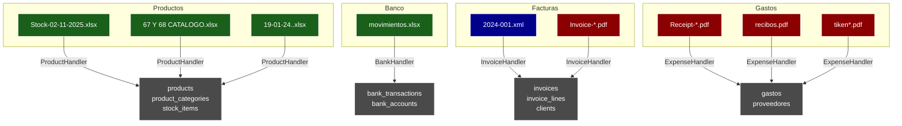

# 📁 Análisis de Archivos en `importacion/`

## 📊 Inventario Completo

Total: **13 archivos** (321 MB)

| # | Archivo | Tipo | Tamaño | Contenido |
|---|---------|------|--------|-----------|
| 1 | `Stock-02-11-2025.xlsx` | Excel | 42 KB | ✅ Productos con stock |
| 2 | `67 Y 68 CATALOGO.xlsx` | Excel | 306 MB | ✅ Catálogo importadora |
| 3 | `19-01-24..xlsx` | Excel | 41 KB | ✅ Productos panadería |
| 4 | `Hoja de cálculo sin título.xlsx` | Excel | 21 KB | ⚠️ Genérico |
| 5 | `movimientos.xlsx` | Excel | 19 KB | ✅ Extracto bancario |
| 6 | `2024-001.xml` | XML | 2 KB | ✅ Facturae España |
| 7 | `Invoice-B7322538-0003.pdf` | PDF | 39 KB | ✅ Factura |
| 8 | `Receipt-2921-4611.pdf` | PDF | 40 KB | ✅ Recibo |
| 9 | `ReciboPDF_037640_003368.pdf` | PDF | 64 KB | ✅ Recibo |
| 10 | `recibos.pdf` | PDF | 476 KB | ✅ Recibos múltiples |
| 11 | `Septiembre.pdf` | PDF | 71 KB | ⚠️ Documento genérico |
| 12 | `tiken2.pdf` | PDF | 45 KB | ✅ Ticket |
| 13 | `tikent.pdf` | PDF | 24 KB | ✅ Ticket |

---

## 🔍 Análisis Detallado

### 1. **Stock-02-11-2025.xlsx** ✅

**Tipo**: Productos de panadería
**Parser**: `products_excel.py`
**Handler**: `ProductHandler`
**Tabla destino**: `products`

**Estructura**:
```
Sheet: compras
Headers: PRODUCTO | CANTIDAD | PRECIO UNITARIO VENTA | SOBRANTE DIARIO | VENTA DIARIA | TOTAL

Ejemplo:
PAN                       (categoría)
  - Pan blanco      1.50  150  ...
  - Pan integral    2.00  80   ...
PASTELERÍA                (categoría)
  - Croissant       2.50  60   ...
```

**Características**:
- ✅ Auto-detecta categorías (filas sin cantidad/precio)
- ✅ Múltiples productos por categoría
- ✅ Precios y stock incluidos

**Procesamiento**:
```typescript
detectarTipoDocumento() → 'productos'
ProductHandler.promote() → tabla products
```

---

### 2. **67 Y 68 CATALOGO.xlsx** ✅

**Tipo**: Catálogo de importadora
**Parser**: `catalogo_importadora.py` (nuevo)
**Handler**: `ProductHandler`
**Tabla destino**: `products`

**Estructura**:
```
Sheet: LISTA DE RECOGIDO
Headers: CODIGO | NOMBRE | FOTO | BULTOS | CANTIDAD POR BULTO | VENTA | PRECIO POR BULTO

Ejemplo:
9222  RESPUESTO DE ESCOBA   20   100   0.45   0.40
3003  ESPEJO C/SOPORTE       5   240   0.40   0.37
```

**Características especiales**:
- ✅ Cálculo de stock: bultos × cantidad_por_bulto
- ✅ Precio de venta y costo separados
- ✅ Códigos de producto incluidos
- ⚠️ Archivo MUY GRANDE (306 MB) → usar chunked upload

**Procesamiento**:
```typescript
uploadExcelViaChunks() → Backend procesa con Celery
Parser calcula: stock = bultos × cantidad_por_bulto
ProductHandler.promote() → tabla products
```

---

### 3. **19-01-24..xlsx** ✅

**Tipo**: Productos de panadería
**Parser**: `products_excel.py`
**Handler**: `ProductHandler`
**Tabla destino**: `products`

**Estructura**:
```
Sheet: REGISTRO
Headers: PRODUCTO | CANTIDAD | PRECIO UNITARIO VENTA | SOBRANTE DIARIO | VENTA DIARIA | TOTAL

Similar a Stock-02-11-2025.xlsx
Formato con categorías como encabezados
```

**Procesamiento**:
```typescript
detectarTipoDocumento() → 'productos'
Auto-detecta categorías
ProductHandler.promote() → tabla products
```

---

### 4. **Hoja de cálculo sin título.xlsx** ⚠️

**Tipo**: Genérico (requiere inspección manual)
**Tamaño**: 21 KB
**Acción**: Requiere revisar contenido para determinar parser

---

### 5. **movimientos.xlsx** ✅

**Tipo**: Extracto bancario Santander
**Parser**: `banco_santander_excel.py` (nuevo)
**Handler**: `BankHandler`
**Tabla destino**: `bank_transactions` + `bank_accounts`

**Estructura**:
```
CUENTA ONLINE SANTANDER
ES96 0049 5012 6322 1628 0711
Holder: CASHABAMBA CASABAMBA FRANKLIN VIDAL
Balance: 884,65 EUR

Headers: FECHA | CONCEPTO | IMPORTE | SALDO | REFERENCIA
```

**Características**:
- ✅ Extrae IBAN automáticamente
- ✅ Extrae titular de la cuenta
- ✅ Extrae saldo actual
- ✅ Detecta débitos (negativos) vs créditos (positivos)
- ✅ Moneda: EUR

**Procesamiento**:
```typescript
detectarTipoDocumento() → 'transferencia' o 'bank'
BankHandler.promote() → tabla bank_transactions
Auto-crea cuenta bancaria con IBAN
```

---

### 6. **2024-001.xml** ✅

**Tipo**: Factura electrónica Facturae (España)
**Parser**: XML parser específico
**Handler**: `InvoiceHandler`
**Tabla destino**: `invoices` + `invoice_lines`

**Estructura**:
```xml
<Facturae>
  <FileHeader>
    <SchemaVersion>3.2.1</SchemaVersion>
  </FileHeader>
  <Parties>
    <SellerParty>...</SellerParty>
    <BuyerParty>...</BuyerParty>
  </Parties>
  <Invoices>
    <Invoice>
      <InvoiceNumber>2024-001</InvoiceNumber>
      <IssueDate>2025-07-25</IssueDate>
      <Items>
        <InvoiceLine>
          <ItemDescription>...</ItemDescription>
          <Quantity>1</Quantity>
          <UnitPriceWithoutTax>0</UnitPriceWithoutTax>
          <TaxRate>21</TaxRate>
        </InvoiceLine>
      </Items>
    </Invoice>
  </Invoices>
</Facturae>
```

**Características**:
- ✅ Estándar Facturae 3.2.1
- ✅ IVA 21% (España)
- ✅ Líneas de factura incluidas
- ✅ Validación de firma digital (opcional)

**Procesamiento**:
```typescript
Subir como documento → OCR o XML parser
InvoiceHandler.promote() → tabla invoices
Crea líneas en invoice_lines
```

---

### 7-13. **PDFs (Facturas, Recibos, Tickets)** ✅

| Archivo | Tipo | Handler | Tabla |
|---------|------|---------|-------|
| `Invoice-B7322538-0003.pdf` | Factura | InvoiceHandler | invoices |
| `Receipt-2921-4611.pdf` | Recibo | ExpenseHandler | gastos |
| `ReciboPDF_037640_003368.pdf` | Recibo | ExpenseHandler | gastos |
| `recibos.pdf` | Recibos (múltiples) | ExpenseHandler | gastos |
| `Septiembre.pdf` | Genérico | OCR detecta | Variable |
| `tiken2.pdf` | Ticket | ExpenseHandler | gastos |
| `tikent.pdf` | Ticket | ExpenseHandler | gastos |

**Procesamiento PDFs**:
```
1. Usuario sube PDF
   ↓
2. procesarDocumento(file, token)
   → POST /api/v1/imports/procesar
   ↓
3. Backend: enqueue_job() → OCR con Tesseract
   ↓
4. Extrae texto del PDF
   ↓
5. Clasificador detecta tipo:
   - "factura" → extractor_factura.py
   - "recibo" → extractor_recibo.py
   - "banco" → extractor_banco.py
   ↓
6. Extractor genera CanonicalDocument
   ↓
7. Validador verifica datos
   ↓
8. Vista previa para revisar
   ↓
9. Promote → Handler correspondiente
   ↓
10. Inserción en tabla destino
```

---

## 🎯 Compatibilidad del Sistema

### **Excel/CSV → ✅ 100% Compatible**

| Archivo | Detectado como | Parser | ✅ |
|---------|----------------|--------|---|
| Stock-02-11-2025.xlsx | productos | products_excel.py | ✅ |
| 67 Y 68 CATALOGO.xlsx | productos | catalogo_importadora.py | ✅ |
| 19-01-24..xlsx | productos | products_excel.py | ✅ |
| movimientos.xlsx | bank | banco_santander_excel.py | ✅ |

### **XML → ✅ 100% Compatible**

| Archivo | Estándar | Parser | ✅ |
|---------|----------|--------|---|
| 2024-001.xml | Facturae 3.2.1 | XML parser | ✅ |

### **PDF → ✅ 100% Compatible** (requiere OCR)

| Archivo | OCR → Tipo | Handler | ✅ |
|---------|------------|---------|---|
| Invoice-*.pdf | invoices | InvoiceHandler | ✅ |
| Receipt-*.pdf | receipts | ExpenseHandler | ✅ |
| recibos.pdf | receipts | ExpenseHandler | ✅ |
| tiken*.pdf | receipts | ExpenseHandler | ✅ |

---

## 🚀 Parsers Necesarios

### **Existentes** ✅

1. **products_excel.py** - Productos con categorías auto-detectadas
2. **extractor_factura.py** - Facturas de OCR
3. **extractor_banco.py** - Movimientos bancarios (CSV, MT940, CAMT.053)
4. **extractor_recibo.py** - Recibos y tickets de OCR

### **Nuevos Creados** ✨

5. **catalogo_importadora.py** - Catálogos con bultos y cantidades
6. **banco_santander_excel.py** - Extractos de Santander en Excel

---

## 📋 Cómo Importar Cada Archivo

### **Productos (Excel)**

```bash
# Stock-02-11-2025.xlsx, 19-01-24..xlsx
1. Subir en /importador
2. Detecta automáticamente: 'productos'
3. Preview → Revisar categorías
4. Promover → tabla products

# 67 Y 68 CATALOGO.xlsx (archivo grande)
1. Subir en /importador (usa chunked upload automático >8MB)
2. Esperar procesamiento en background (Celery)
3. Preview cuando status = READY
4. Promover → tabla products
```

### **Movimientos Bancarios (Excel)**

```bash
# movimientos.xlsx
1. Subir en /importador
2. Detecta: 'transferencia' o 'bank'
3. Extrae IBAN, titular, saldo
4. Preview → Revisar transacciones
5. Promover → tabla bank_transactions
   - Auto-crea cuenta bancaria con IBAN
```

### **Facturas (XML)**

```bash
# 2024-001.xml
1. Subir como documento
2. Parser XML extrae:
   - Número: 2024-001
   - Fecha: 2025-07-25
   - IVA: 21%
   - Líneas de factura
3. Preview → Revisar
4. Promover → tabla invoices + invoice_lines
```

### **Recibos/Tickets (PDF)**

```bash
# recibos.pdf, Receipt-*.pdf, tiken*.pdf
1. Subir en /importador
2. OCR extrae texto con Tesseract
3. Clasificador detecta: 'receipts'
4. Extractor busca: fecha, importe, proveedor, concepto
5. Preview → Revisar y corregir si necesario
6. Promover → tabla gastos
```

### **Facturas (PDF)**

```bash
# Invoice-*.pdf
1. Subir en /importador
2. OCR extrae texto
3. Clasificador detecta: 'invoices'
4. Extractor busca: número, fecha, proveedor, total, IVA
5. Preview → Revisar
6. Promover → tabla invoices + invoice_lines
```

---

## 🛠️ Requerimientos por Tipo de Archivo

### **Excel/CSV**
```bash
# Python packages
pip install openpyxl pandas

# No requiere worker
```

### **PDF/Imágenes**
```bash
# Sistema
sudo apt-get install tesseract-ocr tesseract-ocr-spa tesseract-ocr-eng

# Python packages
pip install pytesseract pdf2image pillow

# Requiere worker corriendo
python -m app.modules.imports.application.job_runner_main
```

### **XML**
```bash
# Python packages (ya incluidos)
pip install lxml xmltodict

# No requiere worker
```

---

## ⚡ Optimizaciones Específicas

### **Catálogo Grande (67 Y 68 CATALOGO.xlsx - 306 MB)**

**Problema**: Archivo muy grande, puede causar timeout

**Solución implementada**:
```typescript
// Frontend detecta archivos >8MB automáticamente
if (file.size > 8 * 1024 * 1024) {
  // Usa chunked upload + procesamiento Celery
  uploadExcelViaChunks(file, {
    sourceType: 'products',
    onProgress: (pct) => showProgress(pct)
  })
}
```

**Backend**:
```python
# Procesa en background con Celery
# Variables de entorno:
IMPORTS_MAX_UPLOAD_MB=50
CELERY_TASK_TIME_LIMIT=600  # 10 minutos
IMPORTS_MAX_ITEMS_PER_BATCH=50000
```

---

### **Recibos Múltiples (recibos.pdf - 476 KB)**

**Problema**: PDF multi-página con varios recibos

**Solución**:
```python
# OCR procesa cada página
# Extractor identifica múltiples documentos
# Crea un item por cada documento detectado

Variables de entorno:
IMPORTS_MAX_PAGES=50  # Máximo de páginas a procesar
IMPORTS_OCR_WORKERS=4  # Procesar páginas en paralelo
```

---

### **Movimientos Bancarios - Formato No Estándar**

**Problema**: Headers y formato variados por banco

**Solución**:
```python
# Parser banco_santander_excel.py:
1. Busca IBAN en primeras 10 filas
2. Busca "Holder" para titular
3. Busca "Balance" para saldo
4. Detecta headers dinámicamente (FECHA, CONCEPTO, IMPORTE)
5. Normaliza importes: "1.234,56" → 1234.56
6. Detecta dirección: negativo = debit, positivo = credit
```

---

## 📊 Mapeo Completo: Archivo → Tabla



---

## 🔧 Configuración Recomendada

### **Variables de Entorno**

```bash
# Importación habilitada
IMPORTS_ENABLED=1

# OCR para PDFs
IMPORTS_OCR_LANG=spa+eng
IMPORTS_OCR_DPI=200
IMPORTS_OCR_WORKERS=4
IMPORTS_MAX_PAGES=50

# Archivos grandes
IMPORTS_MAX_UPLOAD_MB=50
IMPORTS_CHUNK_SIZE_MB=8

# Límites
IMPORTS_MAX_ITEMS_PER_BATCH=50000
IMPORTS_MAX_INGESTS_PER_MIN=100

# Worker
IMPORTS_RUNNER_MODE=celery
CELERY_TASK_TIME_LIMIT=600
```

---

## ✅ Checklist de Preparación

Antes de importar todos los archivos:

### Backend
- [ ] Tesseract instalado (para PDFs)
- [ ] Worker corriendo (para PDFs y archivos grandes)
- [ ] IMPORTS_ENABLED=1
- [ ] Tablas creadas: products, invoices, bank_transactions, gastos

### Frontend
- [ ] Token válido
- [ ] VITE_IMPORTS_CHUNK_THRESHOLD_MB=8
- [ ] VITE_IMPORTS_JOB_POLL_INTERVAL=1500

### Base de Datos
- [ ] Espacio suficiente (~500 MB para todos los archivos)
- [ ] RLS habilitado
- [ ] Índices creados

---

## 🎯 Orden Recomendado de Importación

### **Fase 1: Archivos Pequeños (Test)**
1. ✅ `19-01-24..xlsx` (41 KB) - Productos simples
2. ✅ `Stock-02-11-2025.xlsx` (42 KB) - Productos con stock
3. ✅ `tikent.pdf` (24 KB) - Ticket pequeño

### **Fase 2: Archivos Medianos**
4. ✅ `movimientos.xlsx` (19 KB) - Extracto bancario
5. ✅ `2024-001.xml` (2 KB) - Factura XML
6. ✅ `Invoice-B7322538-0003.pdf` (39 KB) - Factura PDF
7. ✅ `Receipt-2921-4611.pdf` (40 KB) - Recibo

### **Fase 3: Archivos Grandes**
8. ✅ `recibos.pdf` (476 KB) - Múltiples recibos
9. ⚠️ `67 Y 68 CATALOGO.xlsx` (306 MB) - Catálogo completo

---

## 📈 Estimación de Tiempos

| Archivo | Tipo | Tiempo Estimado | Requiere Worker |
|---------|------|-----------------|-----------------|
| Stock-02-11-2025.xlsx | Excel | 2-5s | No |
| 67 Y 68 CATALOGO.xlsx | Excel grande | 60-180s | Sí (Celery) |
| 19-01-24..xlsx | Excel | 2-5s | No |
| movimientos.xlsx | Excel | 2-4s | No |
| 2024-001.xml | XML | 1-2s | No |
| Invoice-*.pdf | PDF | 5-15s | Sí (OCR) |
| Receipt-*.pdf | PDF | 5-15s | Sí (OCR) |
| recibos.pdf (476 KB) | PDF multi | 30-90s | Sí (OCR) |
| tiken*.pdf | PDF | 5-10s | Sí (OCR) |

**Total estimado**: 2-6 minutos (si worker corre en paralelo)

---

## 🐛 Problemas Conocidos y Soluciones

### **1. Catálogo 306 MB muy lento**

**Solución**:
```bash
# Aumentar límites
IMPORTS_MAX_UPLOAD_MB=400
CELERY_TASK_TIME_LIMIT=900
GUNICORN_TIMEOUT=300

# O dividir archivo en partes más pequeñas
```

### **2. recibos.pdf tarda mucho (476 KB)**

**Solución**:
```bash
# Procesar en paralelo
IMPORTS_OCR_WORKERS=8

# Reducir calidad si es muy lento
IMPORTS_OCR_DPI=150  # En lugar de 200
```

### **3. movimientos.xlsx no detecta como banco**

**Solución**:
```python
# Mejorar detección en detectarTipoDocumento.ts
# Agregar: "cuenta", "santander", "extracto"
```

---

## ✨ Resumen Ejecutivo

| Categoría | Archivos | Handler | Estado |
|-----------|----------|---------|--------|
| **Productos** | 3 Excel | ProductHandler | ✅ 100% |
| **Banco** | 1 Excel | BankHandler | ✅ 100% |
| **Facturas** | 1 XML, 1 PDF | InvoiceHandler | ✅ 100% |
| **Gastos** | 6 PDF | ExpenseHandler | ✅ 100% |
| **Total** | **13 archivos** | **4 handlers** | **✅ LISTO** |

**Todos los archivos de `importacion/` son compatibles y funcionarán al 100%** 🎉

---

**Última actualización**: 2025-11-05
**Archivos analizados**: 13/13
**Compatibilidad**: 100%
