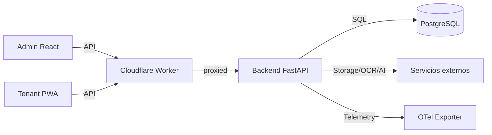
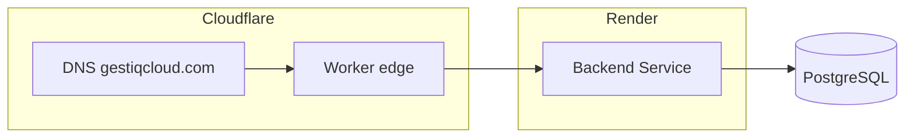
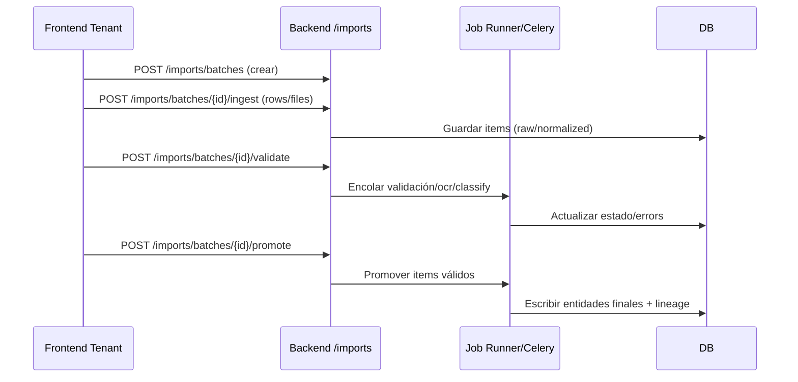

# Arquitectura

GestiQCloud es un ERP/CRM multi-tenant con backend FastAPI + PostgreSQL, frontends React (Admin y Tenant PWA), workers edge en Cloudflare y scripts de operaciones para migraciones e infra.

## Contexto
- Multi-tenant España/Ecuador, cookies con SameSite según dominio, CORS estricto en el worker.
- Se prioriza tests en SQLite para CI, Postgres en entornos reales.
- Importaciones masivas, facturación y pagos con integraciones externas.

## Componentes
- Backend (`apps/backend`): FastAPI + SQLAlchemy, migraciones Alembic, jobs de importación (Celery/job runner), plantillas HTML/PDF para facturación.
- Frontends (`apps/admin`, `apps/tenant`): React + Vite; tenant es PWA/offline, admin para configuración global.
- Paquetes compartidos (`apps/packages`): UI, tipos API, auth/http-core, endpoints, utils, PWA plugin, telemetry.
- Worker (`workers/`): Cloudflare Worker que aplica CORS, endurece cookies y propaga request IDs hacia el backend.
- Operaciones (`ops/`): migraciones SQL manuales, scripts de orquestación, DNS, systemd y CI helpers.

## Multitenancy
- Columna `tenant_id` en tablas de negocio; plantillas de sector/empresa y configuración modular.
- Cookies con dominio `.gestiqcloud.com` y SameSite diferenciado (`access_token` Lax, `refresh_token` None).
- RLS preparado en schema consolidado; aislamiento lógico y rate limiting por IP en rutas sensibles.

## Integraciones externas
- Pagos: Stripe, Payphone, Kushki (ver `apps/backend/app/services/payments/*`).
- Facturación electrónica: módulo `einvoicing`.
- Telemetría/metrics: `apps/backend/app/telemetry/otel.py`, paquetes `apps/packages/telemetry` y `shared`.
- Edge: Cloudflare Worker para CORS/cookies y request IDs.

## Flujos clave
- Auth: login en `/api/v1/tenant/auth/login` y `/api/v1/admin/auth/login`, cookies gestionadas en backend y reescritas por el worker.
- Importaciones: endpoints `/api/v1/imports/*`, pipeline con tareas (OCR, clasificación, preview, publish) y job runner opcional en startup si `IMPORTS_ENABLED=1` y tablas listas.
- Facturación/ventas: routers en `app/modules/*/interface/http` montados automáticamente en `app/platform/http/router.py`.
- Salud: `/health`, `/ready` (DB/Redis), `/docs` y `/redoc` con assets locales.

## Diagramas
- Vista de contexto

- Despliegue (ejemplo Render + Cloudflare)

- Flujo de importación (simplificado)

## Pendientes
- Documentar dominios por módulo (ventas, compras, contabilidad, etc.).
- Añadir RLS efectivo y políticas si aplican en Postgres.
- Incluir topologías de despliegue por entorno.
