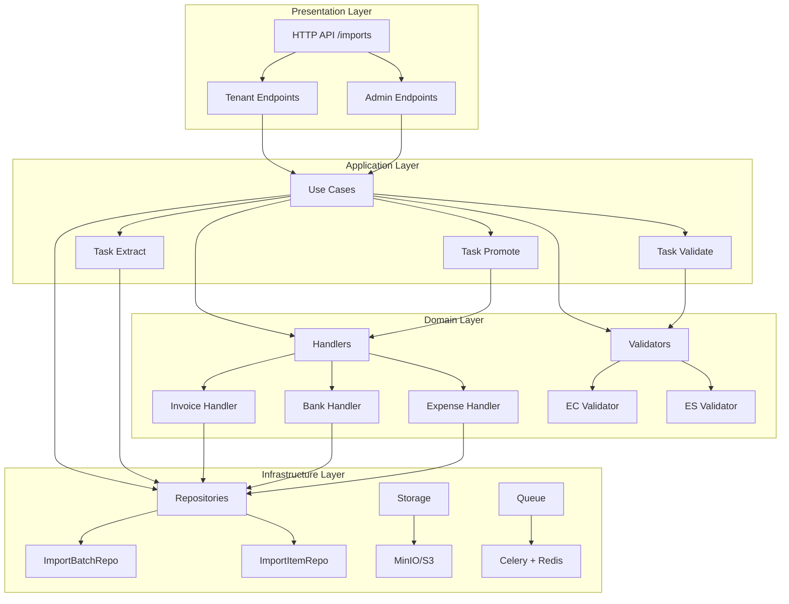
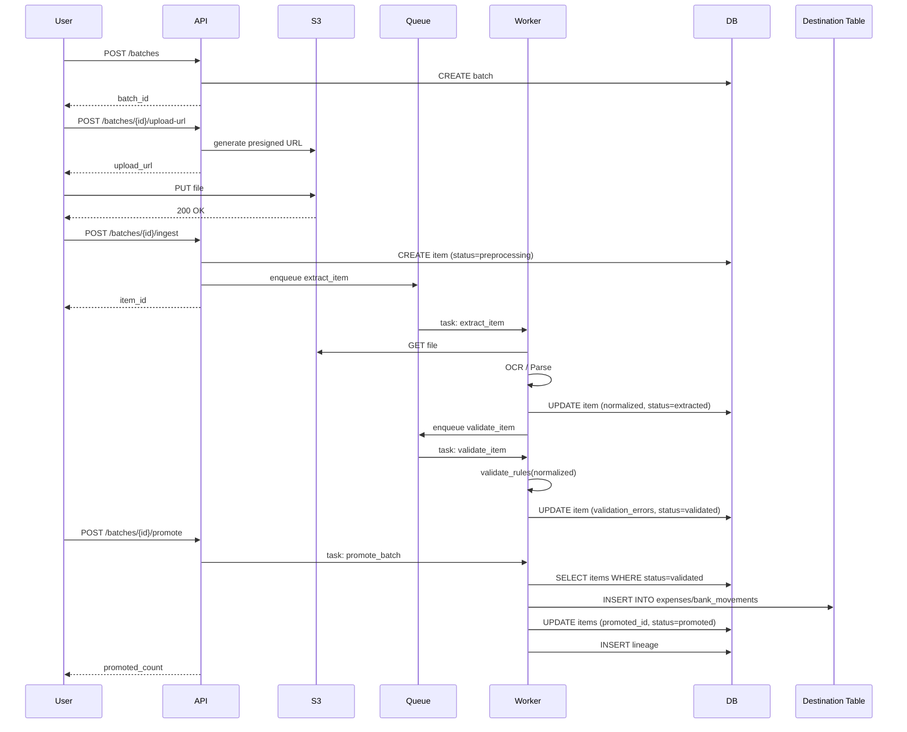
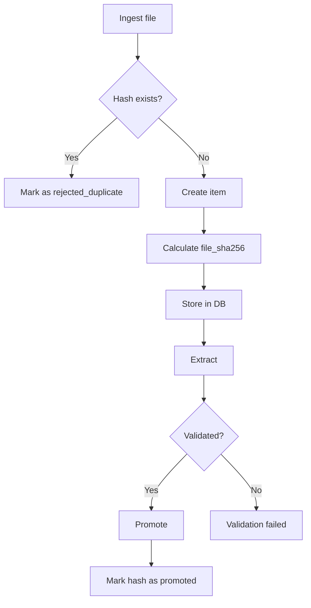

# Arquitectura del Módulo de Importación

## Visión general

El módulo de importación sigue una arquitectura **en capas** con **DDD ligero** y **procesamiento asíncrono**.



## Capas detalladas

### 1. Interface Layer (HTTP)

**Ubicación**: `app/modules/imports/interface/http/`

**Responsabilidades**:
- Autenticación y autorización
- Validación de entrada (Pydantic schemas)
- Serialización de respuestas
- Logging de requests

**Archivos**:
- `tenant.py`: Endpoints para usuarios tenant (CRUD batches/items, correcciones)
- `admin.py`: Endpoints administrativos (métricas, reprocess)
- `schemas.py`: Pydantic models

**Ejemplo**:
```python
@router.post("/batches", response_model=BatchResponse)
def create_batch(
    request: CreateBatchRequest,
    current_user: User = Depends(get_current_user),
    db: Session = Depends(get_db),
):
    batch = use_cases.create_batch(
        db=db,
        empresa_id=current_user.empresa_id,
        source_type=request.source_type,
        description=request.description,
    )
    return batch
```

### 2. Application Layer (Use Cases)

**Ubicación**: `app/modules/imports/application/`

**Responsabilidades**:
- Orquestación de flujo de negocio
- Invocación de tasks asíncronas
- Transacciones DB
- Auditoría

**Archivos**:
- `use_cases.py`: Funciones principales (`create_batch`, `ingest_file`, `promote_batch`)
- `tasks/task_extract.py`: Celery task de extracción
- `tasks/task_validate.py`: Celery task de validación
- `tasks/task_promote.py`: Celery task de promoción

**Flujo típico**:
```python
def ingest_file(db, empresa_id, batch_id, file_key, filename, file_size, file_sha256):
    # 1. Verificar duplicados
    if repository.exists_promoted_hash(db, empresa_id, file_sha256):
        return create_item(status="rejected_duplicate")
    
    # 2. Crear item
    item = create_item(status="preprocessing")
    db.add(item)
    db.commit()
    
    # 3. Encolar task de extracción
    task_extract.apply_async((str(item.id), str(tenant_id), str(batch_id)))
    
    return item
```

### 3. Domain Layer

**Ubicación**: `app/modules/imports/domain/`

**Responsabilidades**:
- Lógica de negocio pura
- Validación de reglas fiscales
- Transformación de datos (normalización → promoción)

**Archivos**:
- `handlers.py`: Handlers por tipo de documento (`InvoiceHandler`, `BankHandler`, `ExpenseHandler`)
- `canonical_schema.py`: Esquema canónico y validación de estructura
- `validators.py`: Interfaz de validadores

**Ejemplo**:
```python
class InvoiceHandler:
    @staticmethod
    def promote(normalized: dict, promoted_id: Optional[str] = None) -> PromoteResult:
        expense = {
            "id": promoted_id or str(uuid.uuid4()),
            "proveedor_tax_id": normalized["proveedor"]["tax_id"],
            "proveedor_nombre": normalized["proveedor"]["nombre"],
            "subtotal": normalized["totales"]["subtotal"],
            "iva": normalized["totales"]["iva"],
            "total": normalized["totales"]["total"],
            "fecha_emision": normalized["fecha_emision"],
        }
        return PromoteResult(
            destination_table="expenses",
            destination_id=expense["id"],
            payload=expense,
        )
```

### 4. Infrastructure Layer

**Ubicación**: `app/modules/imports/infrastructure/`

**Responsabilidades**:
- Acceso a DB (repositorios)
- Almacenamiento de archivos (S3)
- Colas (Celery/Redis)
- Servicios externos (ClamAV, OCR)

**Archivos**:
- `repositories.py`: Consultas DB especializadas
- `storage.py`: Cliente S3/MinIO
- `security_guards.py`: Integración ClamAV

### 5. Extractors

**Ubicación**: `app/modules/imports/extractores/`

**Responsabilidades**:
- Parseo de PDFs (PyMuPDF, pypdf)
- Parseo de XML (SRI, Facturae)
- OCR de imágenes (Tesseract)
- Parseo de CSV/Excel (pandas)

**Archivos**:
- `invoice_extractor.py`: Facturas PDF/XML
- `bank_extractor.py`: CSVs bancarios, CAMT.053
- `photo_utils.py`: Mejora de imagen + OCR

### 6. Validators

**Ubicación**: `app/modules/imports/validators/`

**Responsabilidades**:
- Validación fiscal por país
- Verificación de checksums (RUC, clave de acceso)
- Validación de estructura (totales vs líneas)

**Archivos**:
- `country_validators.py`: `EcuadorValidator`, `SpainValidator`
- `base_validator.py`: Interfaz base

## Patrones de diseño

### 1. Repository Pattern

Abstrae acceso a datos:

```python
class ImportBatchRepository:
    def get_by_id(self, db: Session, batch_id: UUID) -> ImportBatch:
        return db.query(ImportBatch).filter_by(id=batch_id).first()
    
    def get_items_by_status(self, db: Session, batch_id: UUID, status: str):
        return db.query(ImportItem).filter_by(batch_id=batch_id, status=status).all()
```

### 2. Strategy Pattern (Validators)

```python
class CountryValidatorFactory:
    @staticmethod
    def get_validator(country: str) -> CountryValidator:
        if country == "EC":
            return EcuadorValidator()
        elif country == "ES":
            return SpainValidator()
        else:
            return DefaultValidator()
```

### 3. Handler Pattern (Domain)

Cada tipo de documento tiene su handler:

```python
handler = {
    "invoices": InvoiceHandler,
    "bank": BankHandler,
    "expenses": ExpenseHandler,
}[source_type]

result = handler.promote(normalized)
```

### 4. Task Pattern (Async)

```python
@celery_app.task(bind=True, max_retries=3)
def extract_item(self, item_id: str, tenant_id: str, batch_id: str):
    try:
        # Lógica de extracción
        ...
    except Exception as exc:
        self.retry(exc=exc, countdown=60)
```

## Flujo de datos

### Pipeline completo



### Deduplicación



## Seguridad (RLS)

### Configuración de tenant en sesión

```python
# Middleware FastAPI
@app.middleware("http")
async def tenant_middleware(request: Request, call_next):
    tenant_id = get_tenant_id_from_token(request)
    
    with get_db() as db:
        db.execute(f"SET LOCAL app.tenant_id = '{tenant_id}'")
        response = await call_next(request)
    
    return response
```

### Políticas RLS

```sql
-- import_batches
CREATE POLICY tenant_isolation ON import_batches
  FOR ALL
  TO authenticated_user
  USING (tenant_id = current_setting('app.tenant_id', true)::uuid)
  WITH CHECK (tenant_id = current_setting('app.tenant_id', true)::uuid);

-- import_items
CREATE POLICY tenant_isolation ON import_items
  FOR ALL
  TO authenticated_user
  USING (tenant_id = current_setting('app.tenant_id', true)::uuid);

-- import_lineage
CREATE POLICY tenant_isolation ON import_lineage
  FOR ALL
  TO authenticated_user
  USING (tenant_id = current_setting('app.tenant_id', true)::uuid);
```

## Escalabilidad

### Horizontal scaling (workers)

```bash
# Workers por tipo de tarea
celery -A app worker -Q imports.extract --concurrency=8 -n extract@%h
celery -A app worker -Q imports.validate --concurrency=16 -n validate@%h
celery -A app worker -Q imports.promote --concurrency=4 -n promote@%h
```

### Sharding por tenant

Futuro: particionar tablas por tenant_id:

```sql
CREATE TABLE import_batches PARTITION BY HASH (tenant_id);
```

### Caché distribuido

```python
# Redis para resultados de OCR
@cached(key="ocr:{file_sha256}", ttl=86400)
def extract_text_from_pdf(content: bytes, file_sha: str) -> str:
    ...
```

## Observabilidad

### Instrumentación

```python
from opentelemetry import trace

tracer = trace.get_tracer(__name__)

@tracer.start_as_current_span("extract_invoice")
def extract_invoice(pdf_content: bytes, country: str):
    span = trace.get_current_span()
    span.set_attribute("country", country)
    span.set_attribute("content_size", len(pdf_content))
    
    # Lógica de extracción
    ...
```

### Métricas custom

```python
from prometheus_client import Counter, Histogram

items_processed = Counter(
    "imports_items_processed_total",
    "Total de items procesados",
    ["status", "source_type"],
)

ocr_duration = Histogram(
    "imports_ocr_duration_seconds",
    "Latencia de OCR",
    buckets=[0.1, 0.5, 1.0, 2.0, 5.0, 10.0],
)
```

## Diagrama de módulos

```
app/modules/imports/
├── interface/
│   └── http/
│       ├── tenant.py          # Endpoints tenant
│       ├── admin.py           # Endpoints admin
│       └── schemas.py         # Pydantic models
├── application/
│   ├── use_cases.py           # Orquestación
│   ├── security_guards.py     # AV, sandbox
│   ├── photo_utils.py         # OCR, mejora imagen
│   └── tasks/
│       ├── task_extract.py
│       ├── task_validate.py
│       └── task_promote.py
├── domain/
│   ├── handlers.py            # Invoice/Bank/Expense
│   ├── canonical_schema.py    # Esquema normalizado
│   └── validators.py          # Interfaz validadores
├── infrastructure/
│   ├── repositories.py        # DB queries
│   └── storage.py             # S3 client
├── extractores/
│   ├── invoice_extractor.py
│   ├── bank_extractor.py
│   └── photo_utils.py
└── validators/
    ├── base_validator.py
    └── country_validators.py
```

## Extensibilidad

### Añadir nuevo tipo de documento

1. Crear handler en `domain/handlers.py`:
```python
class NewDocHandler:
    @staticmethod
    def promote(normalized: dict, promoted_id: str = None):
        return PromoteResult(
            destination_table="new_table",
            destination_id=...,
            payload={...},
        )
```

2. Crear extractor en `extractores/new_doc_extractor.py`

3. Registrar en `use_cases.py`:
```python
HANDLERS = {
    "invoices": InvoiceHandler,
    "bank": BankHandler,
    "new_doc": NewDocHandler,  # Nuevo
}
```

### Añadir nuevo país

1. Crear validador en `validators/country_validators.py`:
```python
class MexicoValidator(CountryValidator):
    def validate_tax_id(self, tax_id: str):
        # RFC validation
        ...
```

2. Registrar en factory:
```python
VALIDATORS = {
    "EC": EcuadorValidator,
    "ES": SpainValidator,
    "MX": MexicoValidator,  # Nuevo
}
```
