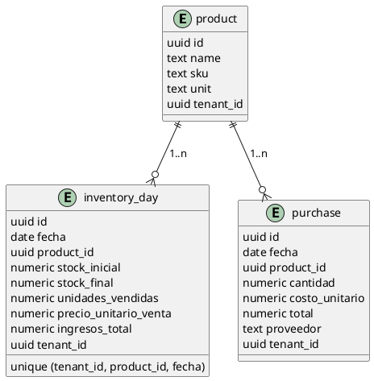
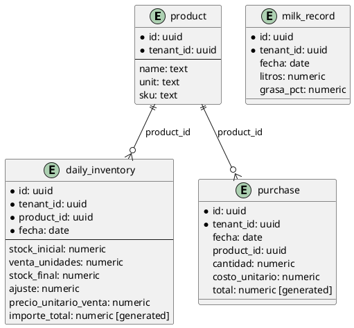
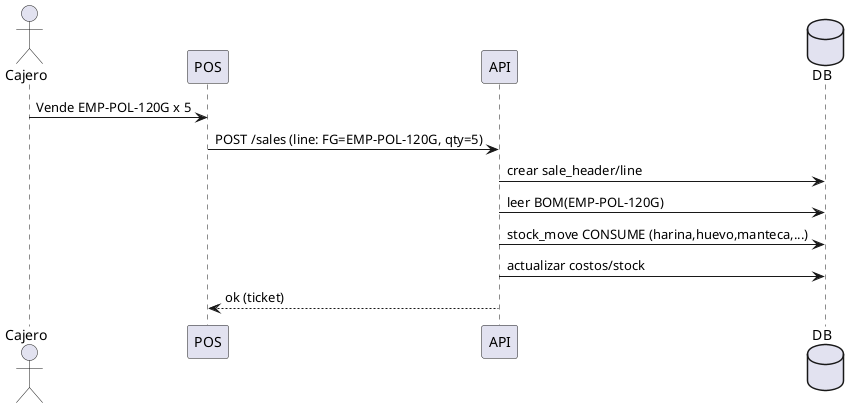
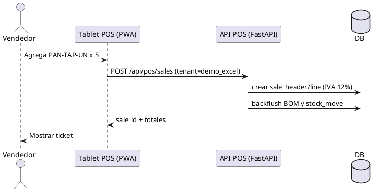
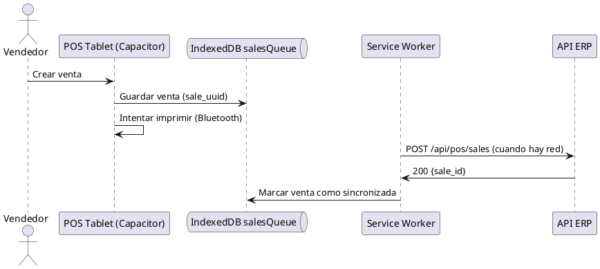

# SPEC-1- Digitalización de registro de ventas y compras (Gestiqcloud)

## Background

Se ha recibido el fichero Excel `22-10-20251.xlsx` con la siguiente estructura inicial (inspeccionada el 23/10/2025):

- **Hojas**: `REGISTRO` (≈283 filas, 7 columnas), `compras` (≈33 filas, 7 columnas), `LECHE` (≈34 filas, 3 columnas), `Hoja1` (vacía).
- **Campos destacados**:
  - `REGISTRO`: `PRODUCTO`, `CANTIDAD`, `PRECIO UNITARIO VENTA`, `SOBRANTE DIARIO`, `VENTA   DIARIA`, `TOTAL` (detectada una columna vacía `Unnamed: 6`).
  - `compras`: parece una plantilla/instrucciones (encabezado «FORMATO DE COMO APUNTAR LAS COMPRAS» y columnas auxiliares vacías).
  - `LECHE`: parece una plantilla/instrucciones (encabezado «FORMATO DE LECHE» y columnas auxiliares vacías).
- **Observaciones**:
  - La hoja **`REGISTRO`** contiene datos reales de ventas/producción por producto, pero **no aparece una columna de fecha/periodo**; esto complica la trazabilidad temporal.
  - Las hojas **`compras`** y **`LECHE`** parecen servir como formato de captura manual más que como tablas normalizadas listas para importar.

**Objetivo de digitalización (asumido):** centralizar ventas (REGISTRO), compras y registros de leche en una **aplicación web** con:
- Carga inicial desde Excel y validaciones.
- CRUD por entidad (productos, ventas diarias, compras, registros de leche).
- Búsqueda/filtrado, exportación (CSV/PDF) y reportes básicos (ventas diarias, márgenes, totales por producto/periodo).
- Control de acceso (roles) y trazabilidad de cambios (histórico/auditoría).

**Alcance y contexto (asumido):** equipo interno de 3–10 personas, idioma español, moneda EUR, operación desde escritorio y móvil. Se prioriza un **MVP** implementable en semanas, preparado para crecer a inventario y conciliación de compras.

> Esta sección describe el punto de partida y nuestras suposiciones para confirmar con negocio antes de definir los requisitos.


### Base tecnológica existente (Gestiqcloud)

Se integrará esta digitalización **dentro de tu SaaS** GESTIQCLOUD (rama `completo`). Arquitectura disponible: FastAPI + SQLAlchemy (backend), React 18 + TypeScript + Tailwind (frontend tenant/admin), PostgreSQL con **multi-tenant y RLS**, sincronización **offline-first** con ElectricSQL y orquestación Docker Compose. Esto permite crear módulos nuevos (ventas/compras/leche) y un **importador desde Excel** sin romper el resto del ERP/CRM.

## Requirements

> Requisitos en formato MoSCoW para el **MVP** de digitalización del fichero y su gestión en GESTIQCLOUD.

### Must Have (imprescindible)
- **Importador Excel** para `22-10-20251.xlsx` con mapeo a tablas normalizadas (ventas diarias, compras, leche, productos) y validaciones (tipos, nulos, totales). Debe ser **idempotente** (reprocesar sin duplicar) y **multi-tenant** (asignar `tenant_id`).
- **Catálogo de productos** (alta/edición/baja) con unidad de medida.
- **CRUD de Ventas Diarias** (por fecha, producto, **stock_inicial**, **venta_unidades**, **stock_final**, **precio_unitario**, **importe_total**).
- **CRUD de Compras** (fecha, proveedor, producto, cantidad, costo unitario, total, observaciones).
- **CRUD de Leche** (fecha, litros, % grasa / notas según formato).
- **Reportes**: ventas por día y por producto; compras por periodo; exportación CSV/PDF.
- **Autenticación/Roles** (admin, operario) y **auditoría**; respetar **RLS** por tenant.

### Should Have (conveniente)
- **Captura offline** (ElectricSQL) con resolución de conflictos sencilla.
- **Carga masiva** adicional (CSV) y edición en bloque.
- **Actualización de inventario** desde ventas/compras (movimientos de stock).
- **Impuestos** configurables por producto.

### Could Have (opcional)
- **Plantillas** de productos.
- **PWA** móvil para operarios.
- **Conectores fiscales** (SRI/SII) para factura simplificada.

### Won’t Have (ahora)
- Contabilidad completa, RRHH o POS avanzado.
## Method (Parte 2) – Hacer que "todos los módulos" funcionen con este Excel (modo prueba)

**Objetivo de la demo end‑to‑end**: con el Excel del cliente poblar **Productos**, **Inventario diario**, **Compras** (si procede), **Ventas** (simuladas a partir de `VENTA DIARIA`), **POS/Facturación** (tickets genéricos), **Kardex/Movimientos de stock** y, de forma opcional, **Contabilidad** (asientos mínimos) para que el ERP se pueda navegar completo.

#### Derivaciones automáticas a partir de `REGISTRO`
- Por cada fila y fecha del lote:
  1) **Producto**: crear/usar `product`.
  2) **Inventario del día**: crear `daily_inventory` con `stock_inicial`, `venta_unidades`, `stock_final`, `precio_unitario_venta`, `ajuste`.
  3) **Movimientos de stock**:
     - `OPENING_BALANCE` (stock inicial → almacén principal).
     - `SALE` (salida de `venta_unidades`).
     - `CLOSING_BALANCE` (ajuste a `stock_final` si hiciera falta).
  4) **Documento de venta simulado** (para que POS/Reportes vean transacciones):
     - `sale_header` (fecha, cliente = "Consumidor Final", forma de pago = "Efectivo").
     - `sale_line` por producto (qty = `venta_unidades`, precio = `precio_unitario_venta`, impuesto según config).
     - **Factura electrónica**: desactivada en demo o en modo "sandbox".
  5) **Asiento contable** (opcional):
     - Debe: Caja/Bancos por `importe_total`.
     - Haber: Ventas por `base imponible`, IVA repercutido por `impuesto`.

> Si más adelante se importan **Compras** reales, se crearán `purchase` + `stock_in` + asiento contable (Proveedor a Compras + IVA soportado).

#### Tablas adicionales (simplificadas para la demo)

```plantuml
@startuml
entity stock_move { id uuid, tenant_id uuid, fecha date, product_id uuid, qty numeric, type text, ref text }
entity sale_header { id uuid, tenant_id uuid, fecha date, customer_id uuid, total numeric, total_tax numeric, payment_method text }
entity sale_line { id uuid, sale_id uuid, product_id uuid, qty numeric, price numeric, tax_pct numeric, total_line numeric }
entity account_move { id uuid, tenant_id uuid, fecha date, ref text }
entity account_move_line { id uuid, move_id uuid, account text, debit numeric, credit numeric }

product ||--o{ stock_move
product ||--o{ sale_line
sale_header ||--o{ sale_line
account_move ||--o{ account_move_line
@enduml
```

**Parámetros por defecto para la demo**
- **Cliente**: "Consumidor Final" (creado si no existe).
- **Proveedor genérico**: "Proveedor Genérico" (para compras si se usan plantillas).
- **Impuesto**: IVA estándar (p.ej., ES 21% o EC 12%) configurable por tenant.
- **Almacén**: "Principal".
- **Redondeo**: 2 decimales en total, 4 en precio.

**Notas**: la columna `TOTAL` del Excel se ignora para cálculo y solo se usa como comparativa/alerta.

## Implementation

### 1) Preparación del entorno
- Clonar rama `completo` y levantar `docker compose up -d` (frontend admin/tenant, backend, db). Revisar README para puertos y accesos. 
- Crear **tenant de demo** (p.ej., `demo_excel`) y un **usuario operario**. 
- Ajustar variables de entorno: IVA por defecto, país, e-factura **en sandbox/off**.

### 2) Migraciones de base de datos
- Añadir tablas: `daily_inventory`, `stock_move`, `sale_header`, `sale_line`, `purchase`, `milk_record`, `import_log` (si no existen). 
- Habilitar **RLS** y `current_setting('app.tenant_id')` en todas.

### 3) Backend (FastAPI)
- Router: `POST /api/imports/excel` (multipart), params: `tenant_id`, `fecha_lote` (opcional), `simulate_sales=true`.
- Servicio `services/import_excel.py`:
  - Parse de hoja `REGISTRO` → normalización → upserts.
  - Generar `stock_move` y `sale_*` si `simulate_sales`.
  - Generar **reporte**: creados/actualizados, alertas (`ajuste ≠ 0`, precios nulos, etc.).
- Tareas opcionales Celery: importación en background con progreso.

### 4) Frontend (React, módulo Admin)
- **Asistente de Importación** (4 pasos): subir archivo → elegir fecha/tenant → vista previa (errores marcados) → confirmar.
- **Panel de Resultados** con KPIs: productos creados, ventas simuladas, ajustes detectados; **CSV de errores** descargable.

### 5) Semillas para que “todos los módulos” respiren
- **Clientes**: crear "Consumidor Final" + 2–3 clientes demo.
- **Proveedores**: "Proveedor Genérico".
- **Cuentas contables**: plantilla mínima por país del tenant.
- **Caja/Banco**: abrir caja inicial (saldo 0). 

### 6) Seguridad y auditoría
- Forzar cabecera `X-Tenant-ID` → `set_config('app.tenant_id', ...)` por request.
- Guardar `source_file`, `source_row`, `digest` en `import_log`.

### 7) Validación
- Reporte de consistencia: `venta_unidades == stock_inicial - stock_final` (si no hay compras).
- Diferencias → listado/CSV para corrección manual.

### 8) Rollback seguro
- Importaciones están referenciadas por `import_log` → **delete by import batch**.

### 9) Entregables
- Migraciones SQL/Alchemy, endpoints FastAPI, pantallas React, script CLI opcional (`python -m app.scripts.import_excel ...`).

## Milestones

1. **M1 – Migraciones & modelos**: tablas nuevas + RLS + seeds demo.
2. **M2 – Importador Excel (REGISTRO)**: upsert + validaciones + reporte.
3. **M3 – Simulación de Ventas y Stock**: `stock_move`, `sale_*` generados desde `REGISTRO`.
4. **M4 – UI Asistente**: flujo completo y CSV de errores.
5. **M5 – Reportes**: ventas por día/producto, inventario final; exportación.
6. **M6 – Compras & Leche** (si hay datos reales en hojas): importación + vistas.
7. **M7 – UAT y Rollback**: script de pruebas y reversión por lote.

## Qué necesito de ti para poblar el ERP con este Excel (modo prueba)

1. **Tenant objetivo** (nombre/UUID) y **usuario** de pruebas.
2. **Fecha del lote** para `REGISTRO` (si no viene en una columna). 
3. **IVA por defecto** del tenant (p.ej., 21% ES o 12% EC) y moneda.
4. **Política de productos**: ¿crear si no existe o mapear manualmente? (lista de sinónimos si aplica).
5. **Unidades** por defecto (unidad/litro/etc.) y redondeos deseados.
6. **Almacén principal** (si gestionas multi-almacén, indicar cuál usar).
7. **¿Simular ventas?** Confirmar que generemos `sale_header/line` para que POS/Reportes funcionen.
8. **Compras/Leche**: ¿contienen datos reales? Si sí, facilitar una copia con 10–20 filas de ejemplo bien formateadas.
9. **Cuentas contables** (si quieres asientos): plantilla mínima o usar la que trae el repo.
10. **Criterios de aceptación**: qué pantallas/KPIs quieres ver operativas tras el import.

## Gathering Results

- **Éxito** = ver en el tenant: catálogo de productos poblado, ventas del día en POS/Reportes, stock actualizado, y (opcional) asientos en contabilidad; sin errores críticos en el resumen de importación.
- KPIs: nº productos creados, % filas con `ajuste=0`, ingreso total calculado, tiempo de importación, nº alertas.

## Need Professional Help in Developing Your Architecture?

Please contact me at [sammuti.com](https://sammuti.com) :)
 (Parte 1) – Mapeo y reglas de importación

**Interpretación de columnas (hoja `REGISTRO`)**
- `PRODUCTO` → `product.name`
- `CANTIDAD` → `inventory_day.stock_inicial` *(según negocio: lo disponible para vender ese día)*
- `SOBRANTE DIARIO` → `inventory_day.stock_final`
- `VENTA DIARIA` → `inventory_day.unidades_vendidas`
- `PRECIO UNITARIO VENTA` → `inventory_day.precio_unitario_venta`
- `TOTAL` → `inventory_day.ingresos_total`

**Ecuaciones de consistencia**
- `unidades_vendidas = stock_inicial - stock_final` *(si no hay compras/producción intradía)*
- `ingresos_total = unidades_vendidas * precio_unitario_venta`
- Si existen compras/producción en el día: `stock_final = stock_inicial + entradas - unidades_vendidas` (entradas vendrán del módulo **Compras** cuando esté operativo)

**Modelo de datos (MVP)**



**Idempotencia del importador**
- Clave natural por fila importada: `(tenant_id, product.name, fecha)` → upsert sobre `inventory_day`.
- Si existe un registro previo, **sobrescribir** los campos con los del Excel y registrar auditoría.

**Validaciones del importador**
- Si `TOTAL` difiere de `VENTA_DIARIA * PRECIO` más de 0,01 → marcar alerta.
- Si `CANTIDAD - SOBRANTE_DIARIO` difiere de `VENTA_DIARIA` → marcar alerta.
- Productos sin coincidencia exacta → crear producto nuevo *(prefijo "[IMP]" y `unit` por defecto = `unit`)* o mapear manualmente en el asistente.

**Gestión de fecha**
- La hoja `REGISTRO` no trae columna `fecha`. Propuesta: el **Asistente de Importación** pedirá una **fecha** para todo el lote o permitirá añadir una columna al vuelo. 
- Alternativa: parsear de nombre de archivo si se confirma convención (ej.: `22-10-2025.xlsx`).


## Method

### Modelo de datos (PostgreSQL, multi-tenant)

> Convenciones: todas las tablas tienen `id UUID PK`, `tenant_id UUID`, `created_at timestamptz`, `created_by UUID`. RLS por `tenant_id`.

```sql
-- Extensiones necesarias
CREATE EXTENSION IF NOT EXISTS pgcrypto; -- para gen_random_uuid()
CREATE EXTENSION IF NOT EXISTS citext;   -- si se usa búsqueda case-insensitive

CREATE TABLE product (
  id UUID PRIMARY KEY DEFAULT gen_random_uuid(),
  tenant_id UUID NOT NULL,
  name text NOT NULL,
  unit text NOT NULL DEFAULT 'unidad',
  sku text,
  is_active boolean NOT NULL DEFAULT true,
  created_at timestamptz NOT NULL DEFAULT now(),
  created_by UUID
);
CREATE UNIQUE INDEX ux_product_tenant_name ON product(tenant_id, lower(name));

CREATE TABLE daily_inventory (
  id UUID PRIMARY KEY DEFAULT gen_random_uuid(),
  tenant_id UUID NOT NULL,
  product_id UUID NOT NULL REFERENCES product(id),
  fecha date NOT NULL,
  stock_inicial numeric(14,3) NOT NULL,
  venta_unidades numeric(14,3) NOT NULL DEFAULT 0,
  stock_final numeric(14,3) NOT NULL,
  ajuste numeric(14,3) NOT NULL DEFAULT 0, -- stock_inicial - venta_unidades - stock_final
  precio_unitario_venta numeric(14,4),
  importe_total numeric(16,4) GENERATED ALWAYS AS (
    CASE WHEN precio_unitario_venta IS NULL THEN NULL
         ELSE round(coalesce(venta_unidades,0) * precio_unitario_venta, 4) END
  ) STORED,
  source_file text,           -- trazabilidad de importación
  source_row int,             -- fila original
  import_digest bytea,        -- SHA256 de la fila canonizada para idempotencia
  created_at timestamptz NOT NULL DEFAULT now(),
  created_by UUID,
  UNIQUE(tenant_id, product_id, fecha)
);
CREATE INDEX ix_daily_inventory_fecha ON daily_inventory(tenant_id, fecha);

CREATE TABLE purchase (
  id UUID PRIMARY KEY DEFAULT gen_random_uuid(),
  tenant_id UUID NOT NULL,
  fecha date NOT NULL,
  supplier_name text,
  product_id UUID REFERENCES product(id),
  cantidad numeric(14,3) NOT NULL,
  costo_unitario numeric(14,4) NOT NULL,
  total numeric(16,4) GENERATED ALWAYS AS (round(cantidad * costo_unitario, 4)) STORED,
  notas text,
  created_at timestamptz NOT NULL DEFAULT now(),
  created_by UUID
);
CREATE INDEX ix_purchase_fecha ON purchase(tenant_id, fecha);

CREATE TABLE milk_record (
  id UUID PRIMARY KEY DEFAULT gen_random_uuid(),
  tenant_id UUID NOT NULL,
  fecha date NOT NULL,
  litros numeric(14,3) NOT NULL,
  grasa_pct numeric(5,2),
  notas text,
  created_at timestamptz NOT NULL DEFAULT now(),
  created_by UUID
);

-- (Opcional) Bitácora de importaciones para idempotencia
CREATE TABLE import_log (
  id UUID PRIMARY KEY DEFAULT gen_random_uuid(),
  tenant_id UUID NOT NULL,
  source_file text NOT NULL,
  sheet text NOT NULL,
  source_row int NOT NULL,
  entity text NOT NULL,   -- 'daily_inventory' | 'purchase' | 'milk_record'
  entity_id UUID NOT NULL,
  digest bytea NOT NULL,
  created_at timestamptz NOT NULL DEFAULT now(),
  UNIQUE(tenant_id, source_file, sheet, source_row)
);

-- RLS (esquema): habilitar y restringir por tenant
ALTER TABLE product ENABLE ROW LEVEL SECURITY;
CREATE POLICY product_tenant_isolation ON product USING (tenant_id = current_setting('app.tenant_id')::uuid);
ALTER TABLE daily_inventory ENABLE ROW LEVEL SECURITY;
CREATE POLICY di_tenant_isolation ON daily_inventory USING (tenant_id = current_setting('app.tenant_id')::uuid);
-- (Repetir para las demás tablas)
```

**Semántica de columnas del Excel (REGISTRO)**

- `CANTIDAD` → `stock_inicial` (lo disponible para vender ese día).
- `VENTA DIARIA` → `venta_unidades` (unidades vendidas en el día).
- `SOBRANTE DIARIO` → `stock_final` (remanente al cierre del día).
- `PRECIO UNITARIO VENTA` → `precio_unitario_venta`.
- `TOTAL` → redundante; se recalcula como `venta_unidades * precio_unitario_venta`.
- `ajuste` (derivado, no existe en Excel): `stock_inicial - venta_unidades - stock_final` (detecta diferencias/mermas).
- **fecha**: si la hoja no trae fecha, se pide en el asistente de importación (por defecto, se sugiere la fecha inferida del nombre del fichero).

### Mapeo de importación (plantilla)

| Hoja Excel | Columna | Tabla destino.campo |
|---|---|---|
| REGISTRO | PRODUCTO | product.name |
| REGISTRO | CANTIDAD | daily_inventory.stock_inicial |
| REGISTRO | VENTA DIARIA | daily_inventory.venta_unidades |
| REGISTRO | SOBRANTE DIARIO | daily_inventory.stock_final |
| REGISTRO | PRECIO UNITARIO VENTA | daily_inventory.precio_unitario_venta |
| REGISTRO | TOTAL | (ignorar; se recalcula) |

*(Las hojas `compras` y `LECHE` se procesan si contienen filas reales; si son plantillas, se omiten.)*

### Algoritmo del importador (idempotente)

1. Usuario sube Excel → selecciona **tenant** y **fecha** por defecto (editable).
2. Se normaliza cada fila (trim, casing, números con coma/punto, celdas vacías → null).
3. Se calcula `digest = sha256(cadena_canonizada_de_fila)` para idempotencia.
4. **Producto**: buscar por `(tenant_id, lower(name))`; si no existe → crear.
5. **DailyInventory**: `upsert` por `(tenant_id, product_id, fecha)` asignando `stock_inicial`, `venta_unidades`, `stock_final`, `precio_unitario_venta`, `ajuste`.
6. Registrar `import_log` con `(tenant_id, source_file, sheet, source_row, entity, entity_id, digest)`.
7. Reportar al usuario: filas creadas/actualizadas, filas con **ajuste ≠ 0** y celdas inválidas.

**Pseudocódigo (FastAPI/SQLAlchemy 2.x):**

```python
for row in parse_excel(file, sheet='REGISTRO'):
    p = get_or_create_product(tenant_id, name=norm(row['PRODUCTO']))
    fecha = infer_or_prompt_date(file_name, user_input)
    stock_inicial = to_decimal(row['CANTIDAD'])
    venta = to_decimal(row['VENTA DIARIA'])
    stock_final = to_decimal(row['SOBRANTE DIARIO'])
    precio = to_decimal(row['PRECIO UNITARIO VENTA'])
    ajuste = (stock_inicial or 0) - (venta or 0) - (stock_final or 0)

    upsert_daily_inventory(
        tenant_id, p.id, fecha,
        stock_inicial=stock_inicial,
        venta_unidades=venta,
        stock_final=stock_final,
        precio_unitario_venta=precio,
        ajuste=ajuste,
        source_meta=meta
    )
```

### Endpoints (FastAPI)

- `POST /api/imports/excel` (archivo, tenant_id, fecha_opcional) → resumen.
- `GET /api/daily-inventory?fecha=...&product=...`
- `POST /api/daily-inventory` | `PUT /api/daily-inventory/{id}` | `DELETE ...`
- `GET /api/reports/ventas?desde=...&hasta=...`
- `GET /api/products` | `POST /api/products` ...

### UI (React + Tailwind)

- **Asistente de importación**: subir archivo → asignar fecha → vista previa → confirmar.
- **Grilla de Ventas Diarias**: editable en línea; resaltado para `ajuste ≠ 0`.
- **Reportes**: totales por día/producto con exportación CSV/PDF.

### Diagramas

**Componentes**

```plantuml
@startuml
skinparam componentStyle rectangle

package "GESTIQCLOUD (SaaS)" {
  [React Frontend] --> [FastAPI Backend]
  [FastAPI Backend] --> [PostgreSQL]
  [React Frontend] ..> [ElectricSQL Client] : offline sync
  [ElectricSQL Client] --> [ElectricSQL Server] --> [PostgreSQL]
}

[Importador Excel] -> [FastAPI Backend] : POST /api/imports/excel
[Reportes] -> [FastAPI Backend]
@enduml
```

**Modelo ER (simplificado)**




## Method (Parte 2 – ajustes con fecha en Excel y configuración Ecuador)

- **Fecha del lote**: el importador leerá primero la fecha **dentro del Excel** (encabezados o primeras filas). Si no la encuentra, intentará extraerla del **nombre de archivo** (formato tipo `dd-mm-aaaa`). En última instancia, el asistente pedirá la fecha manualmente. Para este archivo, se usará **22/10/2025**.
- **IVA y demo**: el tenant de prueba se configurará con **IVA 12% (Ecuador)**. Se crearán ventas simuladas desde `VENTA DIARIA` para que **POS/Reportes** funcionen con datos reales de ese día.
- **Suposición de moneda**: usaremos **USD** salvo indicación contraria.

### Flujo de importación actualizado
1) Subida del Excel → detección de **fecha del lote** (dentro del archivo o por nombre).
2) Previsualización con cálculo: `venta_unidades = CANTIDAD - SOBRANTE_DIARIO` y `ingresos = venta_unidades × precio_unitario`.
3) Upsert de `product` y `daily_inventory` (clave: tenant + producto + fecha).
4) Generación opcional de `stock_move` y `sale_header/line` para alimentar POS/Reportes.
5) Resumen de alertas (descuadres, precios nulos) + CSV descargable.

### Parámetros por defecto (demo Ecuador)
- Cliente: **Consumidor Final**.
- Proveedor: **Proveedor Genérico**.
- Almacén: **Principal**.
- IVA: **12%**.
- Fecha lote: **22/10/2025** para este archivo.


## Method (Parte 3) – Ajustes confirmados y cierre del diseño del importador

- La **fecha** se tomará del **nombre del fichero**. Formatos aceptados: `dd-mm-aaaa`, `dd mm aaaa`, `dd_mm_aaaa` (ej.: 22-10-2025.xlsx). Si no se detecta, el asistente pedirá la fecha.
- **Tenant demo**: `demo_excel`.
- **País/IVA**: Ecuador, **IVA 12%**.
- **Moneda**: **USD**.
- Generaremos **ventas simuladas** a partir de VENTA DIARIA para alimentar POS/Reportes y crear movimientos de stock.

### Flujo final de importación
1) Subida del Excel → detección de fecha desde el nombre del archivo.
2) Previsualización con reglas de consistencia (venta = cantidad - sobrante, ingresos = venta × precio).
3) Upsert de productos e inventario diario (clave: tenant + producto + fecha).
4) Generación de movimientos de stock y documentos de venta (modo demo) para que todos los módulos tengan datos.
5) Resumen y CSV de alertas + opción de rollback por lote.

### Próximo paso
- Implementar el endpoint `/api/imports/excel` y la pantalla de asistente en Admin siguiendo lo definido.


## Method (Parte 4) – Panadería profesional: **SKUs**, **Recetas/BOM**, **Costeo** y **Consumo de materia prima**

### 4.1 Codificación de productos (SKUs)
- **Regla propuesta**: `<CATEGORIA>-<VARIANTE>-<PESO>` (p. ej., `EMP-POL-120G`, `PAN-INT-500G`).
- Campos en `product`:
  - `sku` (único, requerido), `name`, `category` (`EMP`, `PAN`, `BOL`, etc.), `unit` (UN), `peso_unitario_g` (opcional), `activo`.
- **Generador de SKU**: slug de categoría + variante (3 letras) + peso en gramos (sin separadores). Colisión → sufijo numérico.

### 4.2 Unidades de medida (UoM) y conversiones
- Tabla `uom` y `uom_conversion` para convertir **recetas** (gramos/ml/unidades) a **stock** (kg/L/UN):
  - `g ↔ kg` (1000 g = 1 kg), `ml ↔ L` (1000 ml = 1 L), `UN ↔ docena` (12 UN = 1 doc). 
- Toda transacción se almacena en **unidad base** (kg, L, UN) y la UI muestra la conversión.

### 4.3 Recetas / BOM (lista de materiales)
- **BOM** por producto terminado:
  - `bom_header`: `product_fg_id`, `yield_unidades` (unidades que produce 1 lote), `merma_pct` (pérdida %), `activo`.
  - `bom_line`: `product_rm_id` (materia prima), `qty_por_unidad` (en UoM de receta, p.ej. g/ml/un), `uom_receta`.
- **Ejemplo (EMP-POL-120G)**
  - `yield_unidades = 100` (lote estándar)
  - Líneas: harina 80 g, huevo 0.25 un, manteca 20 g, sal 2 g, relleno pollo 50 g. `merma_pct = 3%`.

### 4.4 Modos de consumo de materia prima
1) **Backflush por venta (MVP)**: al **registrar una venta** de `n` unidades, se **descuenta automáticamente** la materia prima según la BOM × `n` (aplica merma). Ventaja: simple, perfecto para mostrador. 
2) **Órdenes de producción (PRO)**: se **lanzan lotes** (cocer/hornar) → se consumen MP al **iniciar/finalizar** producción → se **ingresan** productos terminados (PT). Ventaja: control de mermas y costos por lote.

> MVP: **Backflush por venta**. Progresión: habilitar **Órdenes de producción** cuando se requiera trazabilidad por lote.

### 4.5 Costeo
- **MP (materia prima)**: costo **promedio móvil** por producto RM (actualizado con compras).
- **PT (producto terminado)**:
  - **MVP**: costo estándar = **roll-up** de RM (qty BOM × costo promedio) / `yield`, con **merma** imputada proporcional.
  - **PRO**: costo real por **orden de producción** (consumos reales + mano de obra opcional + energía) / unidades buenas.

### 4.6 Esquema de datos (ER)
```plantuml
@startuml
entity product { id uuid, tenant_id uuid, sku text unique, name text, category text, unit text, peso_unitario_g numeric, activo bool }
entity uom { id uuid, code text unique, name text }
entity uom_conversion { id uuid, from_code text, to_code text, factor numeric }
entity bom_header { id uuid, tenant_id uuid, product_fg_id uuid, yield_unidades numeric, merma_pct numeric, activo bool }
entity bom_line { id uuid, bom_id uuid, product_rm_id uuid, qty_por_unidad numeric, uom_receta text }
entity stock_location { id uuid, tenant_id uuid, name text, type text }
entity stock_move { id uuid, tenant_id uuid, fecha date, product_id uuid, qty numeric, uom text, from_loc uuid, to_loc uuid, type text, ref text }
entity sale_header { id uuid, tenant_id uuid, fecha date, total numeric, total_tax numeric }
entity sale_line { id uuid, sale_id uuid, product_id uuid, qty numeric, price numeric, tax_pct numeric }
entity production_order { id uuid, tenant_id uuid, product_fg_id uuid, fecha date, qty_plan numeric, qty_real numeric, estado text }

product ||--o{ bom_header : FG
bom_header ||--o{ bom_line
product ||--o{ bom_line : RM
sale_header ||--o{ sale_line
product ||--o{ sale_line
stock_location ||--o{ stock_move
product ||--o{ stock_move
@enduml
```

### 4.7 Algoritmo de **backflush** (consumo automático por venta)
```pseudo
on_sale_line_committed(tenant, sale_line):
  fg = sale_line.product
  if has_BOM(fg):
     units = sale_line.qty
     for each line in BOM(fg):
        rm = line.product_rm
        qty_rm_base = convert_to_base(line.qty_por_unidad, line.uom_receta)
        consumo = qty_rm_base * units * (1 + merma_pct/100)
        post_stock_move(type=CONSUME, product=rm, qty=consumo, from_loc=RM, to_loc=NULL, ref=sale_line.id)
  else:
     warn("Producto sin BOM: " + fg.sku)
```

### 4.8 Órdenes de producción (resumen)
- `production_order` estados: `PLANIFICADA → EN_PROCESO → FINALIZADA → CERRADA`.
- Al **iniciar**: reservar/consumir MP teórica (o al finalizar: consumo real).
- Al **finalizar**: ingresar PT en `FG` (`RECEIPT`), registrar **mermas** y **rendimiento**.

### 4.9 Secuencia (venta con backflush)


### 4.10 Validaciones y alertas
- **Stock negativo** en RM → alerta (permitir o bloquear según configuración).
- **Producto FG sin BOM** y venta backflush activa → alerta y registro.
- **Conversión UoM** inexistente → bloqueo.

---

## Implementation – Extensiones

### Migraciones (resumen)
- Nuevas tablas: `uom`, `uom_conversion`, `bom_header`, `bom_line`, `stock_location` (al menos `RM` y `FG`), `production_order`.
- Campos nuevos en `product`: `sku`, `category`, `peso_unitario_g`, `activo`.
- Índices/unique: `product.sku` único por tenant, RLS en todas.

### Endpoints FastAPI
- `POST /api/bom` (crear/editar BOM), `GET /api/bom/:product_fg_id`.
- `POST /api/production_orders` (crear), `POST /api/production_orders/:id/start|finish`.
- Hook de **backflush** en `POST /api/sales` (o servicio tras guardar venta).

### UI (Admin + POS)
- **Maestro de productos** con generador de SKU.
- **Editor de recetas** (BOM) con UoM y conversión automática.
- **Informe de consumo de MP** por día/por producto.
- **Producción** (cuando se active): lanzar lote, registrar rendimientos y mermas.

### Costeo
- Servicio de **roll-up** para calcular costo estándar de PT desde BOM.
- Reporte de **margen**: precio venta – costo PT.

### Integración con importación Excel actual
- Si el nombre de producto del Excel **no trae SKU**, generar uno al volar (marcar con prefijo `[IMP]` hasta validar).
- Para **ventas simuladas**, el backflush se ejecuta igual que una venta real.

---

## Milestones (ampliados para panadería)
1. **M1.1**: Tablas UoM y conversiones + nuevas columnas de `product` + `stock_location`.
2. **M1.2**: Modelos y RLS de `bom_*`.
3. **M2**: UI/CRUD de recetas + generador SKU.
4. **M3**: Hook de **backflush** en ventas (POS y simuladas).
5. **M4**: Reportes de consumo y margen.
6. **M5** *(opcional PRO)*: Órdenes de producción y costeo por lote.

---

## Notas
- He interpretado “pantera prima” como **materia prima** (MP).
- Para empezar rápido, dejaremos **backflush** como comportamiento por defecto; cambiar a órdenes de producción es un **toggle** por tenant.


### 4.11 BOM de ejemplo – *Pan Tapado* (unidades mixtas → base)
**Datos del lote (no exactos, enviados por negocio):** 10 **libras** de harina → **120** tapados; **7** huevos; **2 onzas** de manteca; **100 g** de levadura; **10 litros** de agua.

**Conversión a unidades base** (sistema interno): kg, L, UN
- 1 lb = **0.45359237 kg** (≈ 453.59237 g)
- 1 oz = **28.349523125 g** = **0.028349523125 kg**
- 1 L = **1000 ml** (base: L)

**Por lote** (120 unidades):
- Harina: 10 lb = **4.53592370 kg**
- Huevos: **7 UN**
- Manteca: 2 oz = **56.69904625 g** = **0.05669904625 kg**
- Levadura: **100 g** = **0.10000000 kg**
- Agua: **10 L**

**Por unidad (Pan Tapado)** = por lote / 120:
| Insumo   | Cantidad por unidad | Unidad base |
|---|---:|:---|
| Harina   | **0.0377993642** | kg |
| Huevo    | **0.0583333333** | un |
| Manteca  | **0.0004724921** | kg |
| Levadura | **0.0008333333** | kg |
| Agua     | **0.0833333333** | L  |

> En base a 4 decimales para stock y 4–6 para costo, quedarían: Harina **0.0378 kg**, Huevo **0.0583 un**, Manteca **0.0005 kg**, Levadura **0.0008 kg**, Agua **0.0833 L**.

**BOM sugerida**
- `yield_unidades = 120`, `merma_pct` (sugerido inicial) = **3%**. 
- UoM de receta: `g`/`kg`, `L`, `un`. El sistema convierte automáticamente a la unidad base de inventario.

**CSV de carga masiva (ejemplo)**
```csv
sku_fg,name_fg,yield_unidades,merma_pct,rm_sku,rm_name,qty_por_unidad,uom_receta
PAN-TAP-UN,Pan Tapado,120,3,RM-HARINA,Harina de Trigo,0.0377993642,kg
PAN-TAP-UN,Pan Tapado,120,3,RM-HUEVO,Huevo,0.0583333333,un
PAN-TAP-UN,Pan Tapado,120,3,RM-MANTECA,Manteca,0.0004724921,kg
PAN-TAP-UN,Pan Tapado,120,3,RM-LEVADURA,Levadura,0.0008333333,kg
PAN-TAP-UN,Pan Tapado,120,3,RM-AGUA,Agua,0.0833333333,L
```

**Política de redondeo y consumo**
- El **backflush** descuenta cantidades **decimales** por venta; el stock de huevos puede quedar decimal (se recomienda manejar compra por docena pero stock base en UN con decimales). 
- Reporte de **consumos acumulados** agrupa y muestra enteros/decimales para facilitar compras (p.ej., 35.0 huevos ≈ 3 docenas).


## Implementation – Seeds específicas Pan Tapado (demo_excel)

### Archivos CSV generados
- **Productos**: `/mnt/data/demo_excel_products.csv`
- **BOM Pan Tapado**: `/mnt/data/demo_excel_bom_pan_tapado.csv`
- **UoM**: `/mnt/data/demo_excel_uoms.csv`
- **UoM Conversiones**: `/mnt/data/demo_excel_uom_conversions.csv`

### Inserciones SQL (UPERT/ejemplo)
```sql
-- UoM básicas
insert into uom (code,name) values
 ('kg','Kilogramo'),('g','Gramo'),('L','Litro'),('ml','Mililitro'),('UN','Unidad'),('DOC','Docena')
 on conflict (code) do nothing;

-- Productos (usa tenant_id de demo_excel)
-- FG
insert into product (id,tenant_id,sku,name,category,unit,activo)
values (gen_random_uuid(), :tenant_id, 'PAN-TAP-UN','Pan Tapado','PAN','UN', true)
 on conflict (tenant_id, sku) do update set name=excluded.name, category=excluded.category, unit=excluded.unit, activo=true;
-- RM
insert into product (id,tenant_id,sku,name,category,unit,activo) values
(gen_random_uuid(), :tenant_id, 'RM-HARINA','Harina de Trigo','RM','kg', true),
(gen_random_uuid(), :tenant_id, 'RM-HUEVO','Huevo','RM','UN', true),
(gen_random_uuid(), :tenant_id, 'RM-MANTECA','Manteca','RM','kg', true),
(gen_random_uuid(), :tenant_id, 'RM-LEVADURA','Levadura','RM','kg', true),
(gen_random_uuid(), :tenant_id, 'RM-AGUA','Agua','RM','L', true)
 on conflict (tenant_id, sku) do update set name=excluded.name, unit=excluded.unit, activo=true;

-- BOM (header + lines)
with fg as (
  select id from product where tenant_id = :tenant_id and sku='PAN-TAP-UN'
), rm as (
  select sku,id from product where tenant_id = :tenant_id and sku in ('RM-HARINA','RM-HUEVO','RM-MANTECA','RM-LEVADURA','RM-AGUA')
)
insert into bom_header (id, tenant_id, product_fg_id, yield_unidades, merma_pct, activo)
values (gen_random_uuid(), :tenant_id, (select id from fg), 120, 3, true)
returning id into :bom_id;

insert into bom_line (id, bom_id, product_rm_id, qty_por_unidad, uom_receta) values
(gen_random_uuid(), :bom_id, (select id from rm where sku='RM-HARINA'), 0.037799, 'kg'),
(gen_random_uuid(), :bom_id, (select id from rm where sku='RM-HUEVO'), 0.058333, 'UN'),
(gen_random_uuid(), :bom_id, (select id from rm where sku='RM-MANTECA'), 0.000472, 'kg'),
(gen_random_uuid(), :bom_id, (select id from rm where sku='RM-LEVADURA'), 0.000833, 'kg'),
(gen_random_uuid(), :bom_id, (select id from rm where sku='RM-AGUA'), 0.083333, 'L');
```

### Prueba de backflush (venta simulada)
- Vender **5** `PAN-TAP-UN` en fecha **22/10/2025**.
- Consumo esperado (con **merma 3%**): multiplicar cantidades por **5 × 1.03**.
  - Harina ≈ 0.037799 × 5 × 1.03 = **0.194** kg (aprox)
  - Huevo ≈ 0.058333 × 5 × 1.03 = **0.300** un
  - Manteca ≈ 0.000472 × 5 × 1.03 = **0.0024** kg
  - Levadura ≈ 0.000833 × 5 × 1.03 = **0.0043** kg
  - Agua ≈ 0.083333 × 5 × 1.03 = **0.429** L

```http
POST /api/sales HTTP/1.1
X-Tenant-ID: <UUID demo_excel>
Content-Type: application/json

{
  "fecha": "2025-10-22",
  "customer": "Consumidor Final",
  "lines": [
    {"sku": "PAN-TAP-UN", "qty": 5, "price": 0.50, "tax_pct": 12}
  ],
  "payment_method": "Efectivo"
}
```


## Method (Parte 5) – Punto de conexión con ERP y **TPV en tablet** (venta simple)

### Objetivo
Proveer un **punto (endpoint) POS** y una **pantalla mínima** para tablet (Android/iPad) que permita:
- Buscar producto por **SKU/nombre**, fijar **cantidad** y **precio** (o usar precio por defecto).
- **Cobrar** (efectivo) con IVA 12%.
- **Generar venta** (`sale_header/line`), **backflush** de materia prima, **movimientos de stock**, y dejar **ticket simple** para imprimir/compartir.
- **Multi-tenant** con `X-Tenant-ID` y **roles**.

### Endpoints FastAPI (POS)
- `POST /api/pos/sessions/open` → abre sesión de caja; body: `{opening_cash}` → retorna `session_id`.
- `GET  /api/pos/products?q=...` → lista rápida (sku, name, price, tax).
- `POST /api/pos/sales` → crea venta.
- `POST /api/pos/sessions/close` → cierre de caja (totales).
- `GET  /api/pos/receipts/{sale_id}` → payload imprimible (texto/HTML/ESC/POS opcional).

**Contrato `POST /api/pos/sales` (simplificado)**
```json
{
  "fecha": "2025-10-22",
  "session_id": "...",
  "customer": "Consumidor Final",
  "lines": [
    { "sku": "PAN-TAP-UN", "qty": 5, "price": 0.50, "tax_pct": 12 }
  ],
  "payment": { "method": "CASH", "amount": 2.80 }
}
```
**Respuesta**
```json
{ "sale_id": "...", "total": 2.80, "total_tax": 0.30 }
```

### Seguridad
- **Auth**: JWT (login en Admin o PIN corto para POS). 
- **Tenant**: cabecera `X-Tenant-ID: <UUID demo_excel>`.
- **RLS** activa.

### Estructura mínima de datos POS (añadidos)
- `pos_session(id, tenant_id, user_id, opened_at, closed_at, opening_cash, closing_cash)`
- `pos_payment(id, sale_id, method, amount, change)`

### Flujo (secuencia)


### UI mínima (tablet)
- **Buscador** con teclado virtual (por nombre/SKU).
- **Lista de líneas** con qty +/- y precio editable (según rol).
- **Total** con desglose de IVA.
- **Botones**: Cobrar, Borrar todo, Imprimir/Compartir (PDF), Cerrar sesión.
- **PWA** instalable (Service Worker + caché de productos) y **modo offline** con cola de ventas → sincroniza cuando vuelve la conexión (ElectricSQL opcional; en MVP, IndexedDB + reintentos).

### Impresión (opcional)
- **Opción A (rápida)**: generar **ticket HTML** y usar **impresión del sistema** (Share/Print en tablet).
- **Opción B**: **ESC/POS** por Bluetooth (recomendado Android); se agrega adapter JS nativo más adelante.

---

## Implementation – POS (Tablet)
1. **Backend**: implementar endpoints `sessions`, `products`, `sales`, `receipts`; reusar lógica de `sale_*` y backflush.
2. **Frontend (React)**: crear módulo `/pos` como **PWA** simple.
3. **Auth**: login con PIN corto (rol POS) o QR desde Admin para abrir sesión.
4. **Offline**: cachear catálogo; cola de `sales` en IndexedDB; reintento exponencial.
5. **Ticket**: endpoint `receipts/{sale_id}` devuelve HTML básico preparado para imprimir.
6. **Flags demo_excel**: tax=12%, moneda USD; productos y BOM de Pan Tapado cargados.

---


## Method (Parte 6) – **POS tablet con Bluetooth + Offline desde el día 1**

### Decisiones
- **Impresión**: Bluetooth **clásico** (ESC/POS) desde Android tablet mediante **wrapper Capacitor**.
- **Offline-first**: ventas encoladas en **IndexedDB + Workbox Background Sync**; catálogo/precios sincronizados localmente (ElectricSQL/PGlite cuando esté disponible en el proyecto; fallback: cache JSON). 

### Arquitectura POS (resumen)
- **App**: `apps/pos` (React 18 + Vite) empaquetada con **Capacitor** → APK Android.
- **Impresora**: ESC/POS por Bluetooth clásico (SPP). Servicio `printer.ts` detrás de una interfaz `IPrinter`.
- **Cola offline**: `salesQueue` (IndexedDB) gestionada por un **Service Worker** con Workbox; cada venta genera `sale_uuid` para **idempotencia** en el backend.



### Interfaz de impresión
```ts
export interface IPrinter {
  connect(opts?: {mac?: string}): Promise<void>;
  print(bytes: Uint8Array): Promise<void>;
  isConnected(): Promise<boolean>;
}
```

### Implementación sugerida (Android / Capacitor)
- Plugin primario: **Capacitor ESC/POS** (envío de bytes a BT clásico).
- Alternativa: **Bluetooth Serial (Capacitor/Cordova)** si la impresora no tiene SDK.
- Fallback PWA puro: **Web Bluetooth (BLE)** solo si la impresora expone GATT (menos común).

### Flujo de cobro (POS)
1) Buscar SKU → añadir líneas → calcular **IVA 12%**.
2) `Confirmar`: genera `sale_uuid`, guarda en `salesQueue`, **imprime ticket**.
3) **Online**: POST inmediato; **Offline**: encolado y reintento por SW hasta `200`.
4) Backoffice muestra ventas sincronizadas; si hay duplicados, backend usa `sale_uuid` **único** para ignorar reintentos.

### Contratos (idempotencia backend)
- `sale_uuid` (UUID v4 del cliente, unique por tenant) en `POST /api/pos/sales`.
- `unique (tenant_id, sale_uuid)` en `sale_header`.

### UI mínima (tablet)
- Header con **estado de conexión** (online/offline) y **estado impresora** (conectada/no).
- Buscador + líneas con +/- qty, precio editable según rol.
- Totales (base, IVA 12%, total). Botón **Cobrar** y **Imprimir**.

---

## Implementation – POS con Bluetooth + Offline

### Backend
- Añadir `sale_uuid` y constraint única. Reusar backflush tras crear `sale_*`.
- Endpoint `POST /api/pos/sales` acepta ventas **pendientes** con `created_at_client`.

### Frontend (React/Capacitor)
- **Paquetes**: `@capacitor/core`, wrapper BT, `workbox-window`, `idb`, `@tanstack/react-query` (cache & retries).
- **Módulos**:
  - `services/printer.ts`: capa de impresión (BT clásico) + fallback BLE/HTML.
  - `services/queue.ts`: IndexedDB (`salesQueue`) con estados `pending|synced`.
  - `pages/Pos.tsx`: pantalla simple para tablet (PWA) con modo oscuro, botones grandes.
- **Service Worker**:
  - Rutas de sync: POST `/api/pos/sales` con `BackgroundSyncPlugin` (reintentos 24h).

### Ejemplo de ticket ESC/POS (encoder agnóstico)
- Encabezado: "GESTIQCLOUD – demo_excel"
- Fecha/hora, líneas `qty × sku name  price  total`.
- Subtotal, IVA 12%, Total. Gracias.

### Aceptación
- Imprimir ticket **offline** y **sincronizar** la venta al volver la red.
- Reintento exponencial; nunca perder ventas. Si impresora no disponible, permitir **Reimprimir** desde historial local.

---

## Siguientes pasos
1. Confirmar **modelo de impresora** objetivo (marca/modelo) para validar BT clásico.
2. Incluir wrapper **Capacitor** en el repo y generar APK para tablet Android.
3. Activar `sale_uuid` en API y constraint única. 
4. Entregar **Pos.tsx** y `printer.ts` con utilidad de impresión y cola offline.

